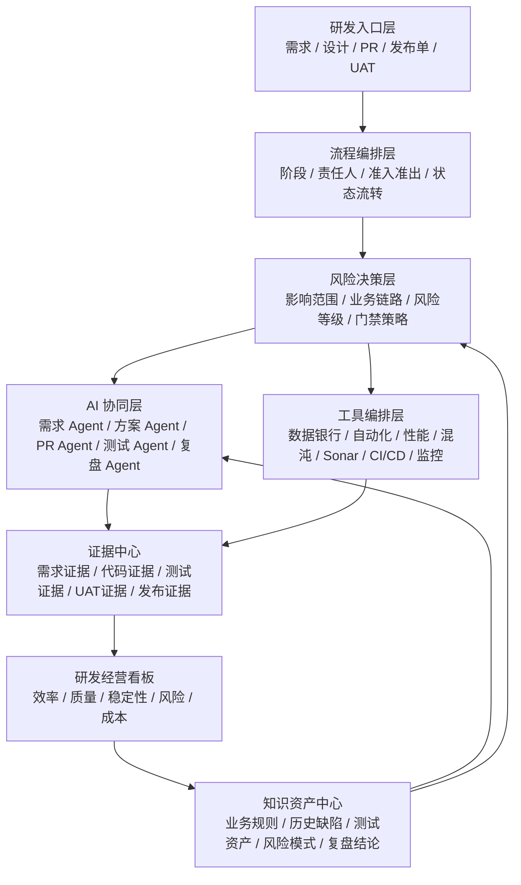
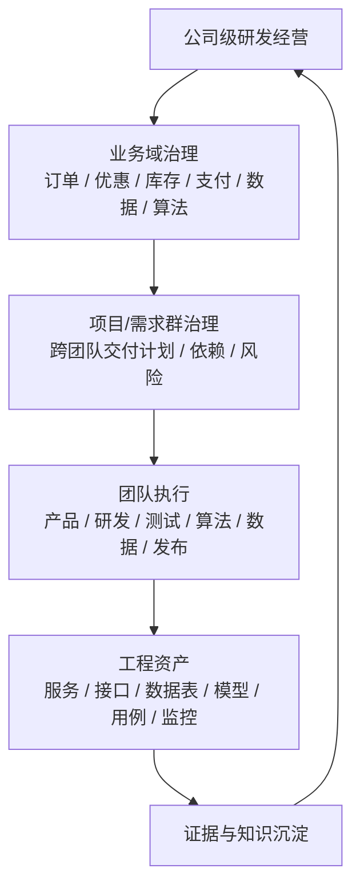
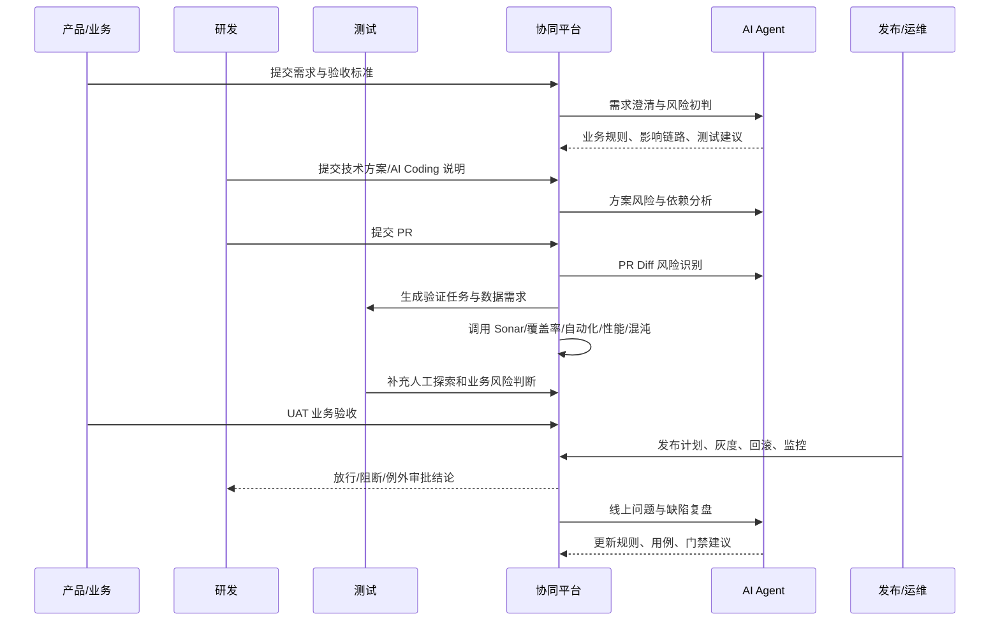
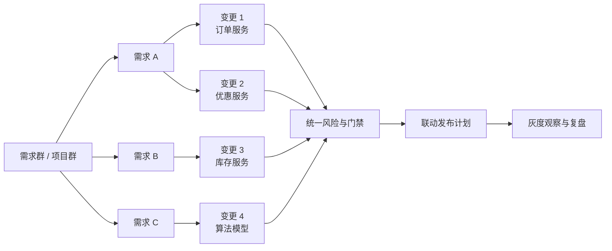
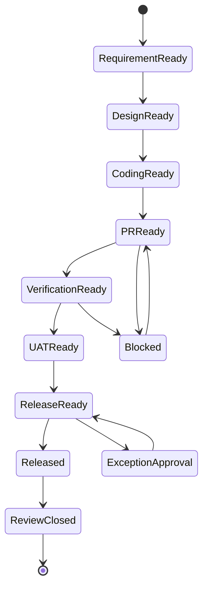
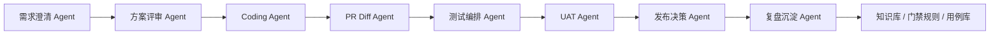
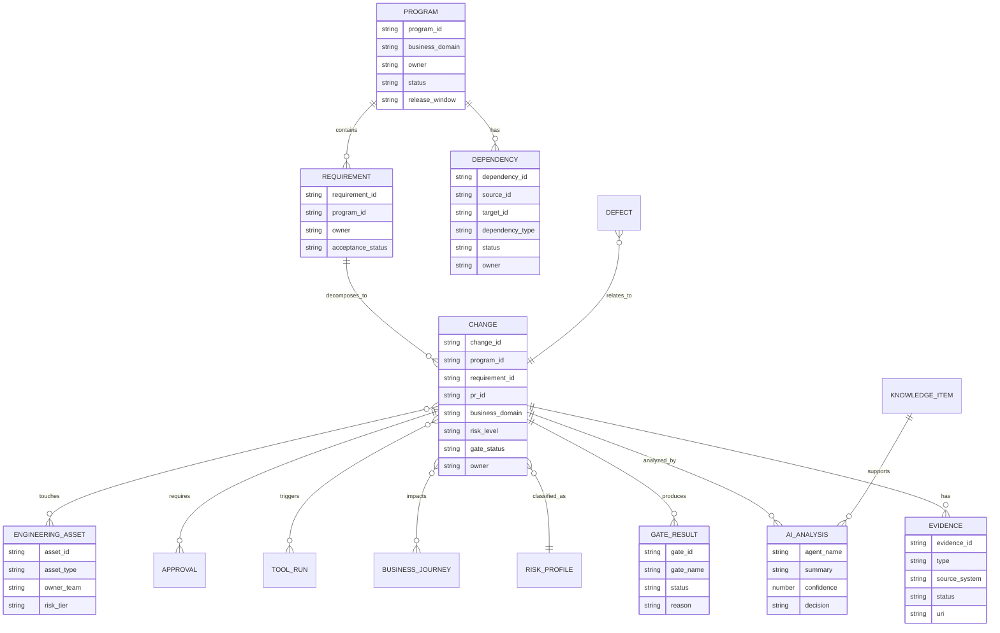

# AI 时代研发协同与质量工程平台整体设计文档

版本：v1.1  
适用对象：CTO、研发负责人、产品负责人、测试负责人、算法负责人、数据负责人、平台工程团队、项目管理团队、业务验收团队  
适用场景：AI Coding 规模化使用后，面向 1000+ 人研发组织和大型复杂系统，围绕完整软件开发生命周期建立流程协同、工具协同、AI 协同、质量风险治理与研发经营能力

## 1. 背景与问题定义

### 1.1 背景

AI Coding 正在改变研发生产方式。研发团队可以更快地产生代码、测试、文档和修复建议，但也带来新的工程管理问题：

- 代码提交量增加，人工 Review 和后置测试压力增大。
- AI 生成代码可能“看起来正确”，但存在业务规则误解、边界遗漏、异常处理缺失、安全默认配置不当等问题。
- AI 生成测试可能只验证 AI 自己的实现路径，无法覆盖真实业务风险。
- 工具平台已有建设，但往往分散在测试、研发、运维、安全等团队，缺少统一流程编排和统一证据视图。
- 质量问题不再只是 QA 团队问题，而是产品、研发、测试、发布、业务验收共同承担的研发协同问题。

因此，本方案不再以“QA 如何测试 AI 代码”为中心，而是以“全研发团队如何协同交付可信软件”为中心。

### 1.1.1 组织规模与复杂性假设

当前研发团队规模约 1000+ 人，覆盖数据、产品、研发、测试、算法、平台、运维、安全、业务验收等多类角色。平台设计必须支持大型组织的协作复杂度，而不是只服务单个项目或单个 QA 团队。

大型复杂系统下的典型挑战：

- **组织复杂**：多个业务线、多个研发团队、多个测试团队、多类平台团队并行工作，责任边界容易模糊。
- **系统复杂**：订单、优惠、库存、支付、履约、会员、搜索、推荐、数据平台、算法平台之间存在大量依赖。
- **变更复杂**：一个需求可能同时涉及前端、后端、数据、算法、风控、监控、运营配置和业务验收。
- **发布复杂**：多团队多服务并行发布，存在灰度窗口、依赖顺序、回滚联动和线上观察窗口。
- **知识复杂**：业务规则、历史缺陷、测试资产、链路依赖和算法特征散落在不同系统和团队中。
- **治理复杂**：不同风险等级、不同业务域、不同团队成熟度，需要差异化门禁，而不是一刀切流程。

因此，平台需要从“变更质量工作台”升级为“企业级研发协同底座”，支撑组织级研发治理、复杂系统依赖管理、跨团队风险协同和规模化知识沉淀。

### 1.2 核心命题

平台需要回答四个问题：

1. **流程如何协同**：需求、设计、AI 编码、PR、测试验证、UAT、发布、复盘如何形成端到端作业流。
2. **工具如何协同**：数据银行、自动化框架、性能平台、混沌工程、Sonar、覆盖率、CI/CD、监控告警如何被统一编排。
3. **AI 如何协同**：AI Agent 如何参与需求澄清、方案评审、PR 风险识别、测试推荐、失败归因、缺陷复盘。
4. **质量如何治理**：如何按风险等级决定门禁强度，并把质量证据沉淀为可审计、可复用、可经营的数据资产。

### 1.3 设计原则

| 原则 | 含义 |
| --- | --- |
| 全研发视角 | 平台面向产品、研发、测试、发布、业务验收，不是 QA 单点工具 |
| 风险驱动 | 风险等级决定流程复杂度、测试强度、审批强度和发布保护 |
| 证据驱动 | 每次变更必须有可追溯证据支撑合并、验收和发布决策 |
| 平台编排 | 由平台编排流程、工具和 AI Agent，减少人肉流转 |
| 人机协同 | AI 负责分析、推荐和生成证据，人负责业务语义、风险裁决和例外审批 |
| 渐进落地 | 先接入现有工具形成闭环，再逐步增强智能化与自动化 |
| 分层治理 | 公司、业务域、团队、服务四层治理分离，规则可继承、可覆盖、可审计 |
| 组织规模化 | 平台要支撑 1000+ 人并行协作，必须具备租户、权限、依赖、待办和经营视图 |
| 复杂系统优先 | 以核心业务链路和跨系统依赖为治理单元，而不是只以代码仓库为治理单元 |

## 2. 行业参考与方案边界

本平台设计参考以下行业方向：

- DORA 2024 指出，AI 能提升个人效率、心流和满意度，但也可能带来交付稳定性和吞吐方面的负面影响，基础工程能力、稳态优先级、小批量交付、强测试仍然关键；内部开发者平台能提升生产力，但需要关注变更稳定性。参考：[DORA 2024](https://dora.dev/research/2024/dora-report/)
- NIST SSDF 强调安全开发实践应被集成到每个 SDLC 实现中，而不是只在后置阶段补充。参考：[NIST SP 800-218](https://csrc.nist.gov/pubs/sp/800/218/final)
- SLSA 将软件供应链完整性、构建来源、产物可信作为持续提高保证级别的工程实践。参考：[SLSA](https://slsa.dev/)
- OWASP GenAI Security Project 覆盖 LLM 应用与 Agentic AI 系统的安全风险治理，适合用于后续 AI Agent 平台自身安全控制。参考：[OWASP Top 10 for LLM Applications](https://owasp.org/www-project-top-10-for-large-language-model-applications/)

本方案边界：

- 本方案建设的是研发协同与质量工程平台，不替代 Jira、Git、CI、自动化测试、监控等现有系统。
- 平台的核心价值是流程编排、风险决策、工具集成、AI 辅助和证据沉淀。
- 安全与供应链不是独立 SDLC 阶段，而是横向控制能力，贯穿需求、设计、编码、PR、测试验证、UAT 准入、发布和复盘。
- 沃尔玛订单交易 case 只使用当前业务真实概念：全场券、商品券，不引入平台券、店铺券等不符合现状的概念。

## 3. 目标架构

### 3.1 平台定位

平台定位为：

> 面向 AI 时代的研发协同操作系统，通过流程编排、工具集成、AI Agent 协同和质量风险治理，让每一次软件变更从需求到发布都可评估、可验证、可追踪、可复盘。

对于 1000+ 人研发组织，平台进一步定位为：

> 企业级研发协同底座，把业务目标、系统依赖、团队分工、工程工具、AI Agent、质量证据和发布决策统一到同一套协同机制中，支撑大型复杂系统持续演进。

### 3.2 总体架构



### 3.2.1 企业级协同视图

平台需要同时支持四类视图：

| 视图 | 使用对象 | 核心问题 |
| --- | --- | --- |
| 公司级经营视图 | CTO、研发 VP、质量负责人 | 整体研发效率、质量、稳定性、AI 代码风险是否可控 |
| 业务域视图 | 业务线负责人、产品负责人、研发负责人 | 订单、库存、支付、履约等核心链路风险和依赖是否清晰 |
| 团队执行视图 | Scrum/项目团队、开发、测试、算法、数据团队 | 当前变更卡在哪里、缺什么证据、谁需要处理 |
| 服务/资产视图 | 服务 Owner、平台团队、架构团队 | 某服务/数据表/模型/接口的依赖、缺陷、覆盖率、发布风险 |



### 3.2.2 业务域与系统域分层

大型复杂系统不能只按团队组织来治理，必须引入“业务域 + 系统域 + 工程资产”的分层模型。

| 层级 | 示例 | 平台治理重点 |
| --- | --- | --- |
| 业务域 | 订单交易、优惠营销、库存履约、支付结算、会员价格 | 业务规则、核心链路、UAT 口径、业务风险 |
| 系统域 | 订单服务、优惠服务、库存服务、支付网关、风控服务 | 服务依赖、接口契约、发布顺序、容量与稳定性 |
| 数据域 | 订单表、库存表、支付流水、用户画像、报表集市 | 数据一致性、数据血缘、批量变更、回溯修复 |
| 算法域 | 推荐模型、搜索排序、风控模型、预测模型 | 模型版本、特征依赖、离线/在线一致性、效果回归 |
| 工程资产 | 代码仓库、接口、用例、监控、告警、数据集 | 资产 Owner、覆盖率、质量债、证据沉淀 |

平台的风险决策必须同时看业务域、系统域、数据域和算法域，避免只看代码 diff 而忽略跨系统影响。

### 3.3 能力分层

| 层级 | 核心能力 | 建设重点 |
| --- | --- | --- |
| 研发入口层 | 需求、设计、PR、测试单、UAT、发布单统一入口 | 减少跨系统查找和人工同步 |
| 流程编排层 | 阶段流转、责任人、准入准出、例外审批 | 把研发流程变成可执行状态机 |
| 风险决策层 | 风险评分、业务链路识别、门禁策略匹配 | 实现低风险快速通过、高风险自动加严 |
| AI 协同层 | 多 Agent 辅助分析、推荐、生成证据 | 提升分析效率，但保留人工裁决 |
| 工具编排层 | 接入现有工程工具并统一触发 | 复用已有平台投资 |
| 证据中心 | 每次变更的全过程证据归档 | 支撑审计、复盘、发布决策 |
| 知识资产中心 | 业务规则、缺陷、用例、链路、Prompt 沉淀 | 让平台越用越准 |
| 研发经营层 | 面向管理层的效率、质量、稳定性指标 | 从项目管理升级为工程经营 |

## 4. 端到端流程设计

### 4.1 标准流程



### 4.1.1 大型复杂系统下的协同流程

对于 1000+ 人团队，一个需求往往不是单团队闭环，而是跨产品、研发、测试、数据、算法、平台、安全和发布团队协同。平台需要支持“需求群/项目群”级协同，而不只是单个 PR。



平台需要支持三层协同对象：

| 协同对象 | 含义 | 平台能力 |
| --- | --- | --- |
| 需求群 / 项目群 | 一个业务目标拆出的多需求集合 | 统一目标、里程碑、依赖、风险、发布计划 |
| 变更 | 某个需求下的代码、数据、配置、模型或测试变更 | 风险分级、门禁、证据、审批 |
| 工程资产 | 服务、接口、数据表、模型、任务、监控、用例 | Owner、依赖、覆盖、历史缺陷、质量债 |

### 4.1.2 跨团队依赖治理

平台需要把跨团队依赖显性化，否则大型复杂系统容易出现“我这边完成了，但整体交付不可用”的问题。

依赖类型：

- 需求依赖：某需求必须等待另一个需求完成。
- 接口依赖：调用方和提供方接口契约变更。
- 数据依赖：数据表、字段、口径、血缘、同步任务变化。
- 模型依赖：算法模型版本、特征、实验、线上效果依赖。
- 发布依赖：服务发布顺序、灰度顺序、回滚联动。
- 测试依赖：联调环境、测试数据、自动化用例、性能压测窗口。

平台能力：

- 自动从 PR、接口契约、服务调用链、数据血缘中识别依赖。
- 对人工声明依赖进行责任人、截止时间、风险状态管理。
- 形成项目群依赖图，显示阻塞路径和关键风险点。
- 在发布前校验依赖是否满足准入。

依赖状态：

| 状态 | 说明 |
| --- | --- |
| Open | 依赖已识别，尚未确认 |
| Accepted | 依赖方确认接受 |
| In Progress | 依赖正在处理中 |
| Blocked | 依赖阻塞整体交付 |
| Resolved | 依赖已完成且证据齐全 |
| Waived | 依赖被例外放行，必须记录审批和复盘 |

### 4.2 阶段准入准出

| 阶段 | 输入 | 平台动作 | 输出/准出 |
| --- | --- | --- | --- |
| 需求准入 | 需求描述、业务目标、验收标准 | AI 需求澄清、规则抽取、影响链路初判 | 结构化需求、验收点、初始风险等级 |
| 设计评审 | 技术方案、接口设计、数据变更、依赖说明 | 架构风险、数据一致性、安全与供应链影响分析 | 方案评审结论、风险缓解措施 |
| AI 编码 | AI 使用说明、Prompt 假设、代码改动 | 编码规范检查、禁止范围校验、单测建议 | 可提交 PR 的代码与自检证据 |
| PR 阶段 | PR diff、关联需求、测试说明 | 风险评分、门禁策略匹配、AI Review、Sonar/覆盖率 | 合并建议、阻断项、补充测试建议 |
| 测试验证 | 测试计划、数据需求、风险等级 | 编排数据银行、接口自动化、E2E、性能、混沌 | 测试证据、缺陷、验证结论 |
| UAT | 业务验收用例、业务规则、关键链路 | 汇总验证证据、突出业务风险和待确认项 | UAT 通过/不通过、业务确认记录 |
| 发布 | 发布单、灰度计划、回滚方案 | 发布门禁、监控绑定、异常预案检查 | 发布准入、灰度策略、回滚预案 |
| 运行复盘 | 监控告警、线上缺陷、用户反馈 | 根因分析、逃逸缺陷归类、规则反哺 | 新增测试、门禁规则、知识库更新 |

### 4.3 风险等级与门禁强度

| 风险等级 | 判断标准 | 门禁要求 | 审批要求 |
| --- | --- | --- | --- |
| L1 低风险 | 文案、样式、非核心页面、无接口/数据变更 | 静态扫描、基础单测、PR Review | 研发 Review |
| L2 中风险 | 普通接口、数据展示、非核心流程逻辑 | Sonar、单测覆盖率不下降、接口自动化、AI Review | 研发 + QA 确认 |
| L3 高风险 | 订单、优惠、库存、支付、会员、履约、价格等核心链路 | 接口自动化、契约/E2E、数据银行、性能基线、混沌场景、UAT 验收 | 研发负责人 + QA负责人 + 业务确认 |
| L4 严重风险 | 金额规则、批量数据、核心交易一致性、跨系统依赖、不可逆数据变更 | L3 全部要求 + 灰度策略 + 回滚演练 + 监控预案 + 例外审批 | 研发负责人 + 业务负责人 + 发布负责人 |

门禁原则：

- 风险等级由平台初判，人可以调整，但必须记录理由。
- 风险越高，自动化证据越多，人工审批越严格。
- 门禁不是为了拖慢所有变更，而是把资源集中到高风险变更。
- 低风险变更应尽可能自动通过，高风险变更必须有证据再放行。

### 4.4 规模化协同节奏

1000+ 人研发团队需要固定协同节奏，平台应提供节奏化运营能力：

| 节奏 | 参与角色 | 会议/动作 | 平台支撑 |
| --- | --- | --- | --- |
| 每日 | 团队负责人、开发、测试、产品 | 查看阻塞变更和缺失证据 | 团队待办、阻塞列表、风险变更列表 |
| 每周 | 业务域负责人、平台、发布、测试负责人 | 核心链路风险 review | 业务域风险看板、依赖图、质量趋势 |
| 每迭代 | 项目群负责人、跨团队 Owner | 需求群交付计划和发布窗口确认 | 项目群视图、里程碑、联动发布计划 |
| 每月 | CTO、研发 VP、质量负责人 | 研发经营复盘 | 公司级 cockpit、AI 代码风险、质量债 |
| 每次线上问题后 | 相关团队、平台、质量、业务 | 缺陷复盘和规则反哺 | 复盘模板、知识库、门禁规则变更 |

平台不是替代管理机制，而是把管理机制数据化、自动化、证据化。

## 5. 核心模块设计

### 5.1 变更工作台

用途：

- 统一承载需求、技术方案、PR、测试验证、UAT、发布状态。
- 展示当前变更的风险等级、阻断项、待办人、证据完整度。
- 给研发、测试、产品、发布负责人提供同一事实视图。

核心字段：

| 字段 | 说明 |
| --- | --- |
| change_id | 变更唯一标识 |
| business_domain | 业务域，如订单、优惠、库存、支付 |
| linked_requirement | 关联需求或项目 |
| ai_generated_ratio | AI 生成/修改代码占比，可由研发声明和平台估算结合 |
| risk_level | L1-L4 风险等级 |
| impacted_services | 影响服务 |
| impacted_journeys | 影响业务链路 |
| gate_status | 门禁状态：通过、阻断、待补充、例外审批 |
| evidence_score | 证据完整度 |
| release_readiness | 发布就绪度 |
| program_id | 所属需求群/项目群 |
| owning_team | 主责团队 |
| participating_teams | 参与团队 |
| dependency_status | 跨团队依赖状态 |
| asset_refs | 关联服务、接口、数据表、模型、用例、监控 |

### 5.1.1 需求群 / 项目群工作台

用途：

- 支撑跨多个团队的大型需求、活动、平台改造和复杂系统升级。
- 汇总多个需求和变更的整体风险、依赖、里程碑、门禁状态。
- 给业务负责人、项目负责人、研发负责人提供“整体是否可交付”的视图。

核心能力：

- 需求群拆解：Epic -> Requirement -> Change -> PR/Task。
- 跨团队依赖图：依赖方、被依赖方、Owner、截止时间、风险。
- 风险聚合：按最高风险、阻塞风险、核心链路风险汇总。
- 联动发布：多个服务、数据任务、模型、配置的发布顺序和灰度计划。
- 证据聚合：每个变更的证据 + 项目群整体发布证据。

项目群状态：

| 状态 | 含义 |
| --- | --- |
| Planning | 需求拆解和依赖识别中 |
| Building | 多团队并行开发中 |
| Verifying | 联调、测试、性能、UAT 中 |
| Release Ready | 关键门禁通过，等待发布窗口 |
| Releasing | 灰度或分批发布中 |
| Observing | 发布后观察窗口 |
| Closed | 复盘完成，知识沉淀完成 |

### 5.1.2 工程资产地图

平台要维护一张企业级工程资产地图，用于支撑影响分析、风险评分和知识沉淀。

资产类型：

- 服务：订单服务、优惠服务、库存服务、支付服务。
- 接口：下单、结算、优惠试算、库存锁定、支付前校验。
- 数据：订单表、优惠明细、库存流水、支付流水。
- 算法：推荐模型、搜索排序模型、风控模型。
- 任务：离线 ETL、同步任务、对账任务。
- 测试资产：接口用例、E2E 用例、性能脚本、混沌场景。
- 监控资产：SLO、告警、仪表盘、业务指标。

每个资产至少需要：

- Owner 团队。
- 技术 Owner。
- 业务 Owner。
- 依赖关系。
- 历史缺陷。
- 覆盖率。
- 质量债。
- 发布风险等级。

### 5.2 流程编排引擎

设计目标：

- 把 SDLC 阶段变成可配置的流程状态机。
- 支持不同风险等级走不同流程。
- 支持例外审批，但例外必须留痕。

状态示例：



可配置项：

- 阶段名称。
- 责任角色。
- 准入条件。
- 准出条件。
- 自动化动作。
- AI Agent 动作。
- 阻断条件。
- 例外审批规则。

### 5.3 风险决策引擎

风险评分维度：

| 维度 | 示例判断 |
| --- | --- |
| 业务链路 | 是否涉及订单、优惠、库存、支付、履约、会员、价格 |
| 代码影响面 | 修改文件数、核心模块、公共组件、接口契约 |
| 数据风险 | 是否涉及金额、库存、状态机、批量写、不可逆变更 |
| AI 风险 | AI 生成代码占比、Prompt 是否清晰、人工理解程度 |
| 历史风险 | 该模块历史缺陷、线上告警、遗留缺陷数量 |
| 测试覆盖 | 单测、接口自动化、E2E、性能、混沌覆盖情况 |
| 发布风险 | 是否支持灰度、回滚、监控、开关降级 |
| 跨团队依赖风险 | 是否涉及多个团队、多个服务、多个发布窗口 |
| 数据/算法风险 | 是否涉及数据口径、模型版本、特征变更、离线在线一致性 |

评分建议：

```text
risk_score =
  business_criticality * 0.25 +
  change_blast_radius * 0.20 +
  data_consistency_risk * 0.20 +
  ai_uncertainty * 0.10 +
  historical_defect_risk * 0.10 +
  test_gap * 0.10 +
  release_protection_gap * 0.05
```

企业级场景下建议扩展为：

```text
enterprise_risk_score =
  business_criticality * 0.20 +
  change_blast_radius * 0.15 +
  data_consistency_risk * 0.15 +
  cross_team_dependency_risk * 0.15 +
  ai_uncertainty * 0.10 +
  historical_defect_risk * 0.10 +
  test_gap * 0.10 +
  release_protection_gap * 0.05
```

跨团队依赖风险评分：

| 分数 | 场景 |
| --- | --- |
| 1 | 单团队、单服务、无外部依赖 |
| 2 | 单团队、多服务或少量接口依赖 |
| 3 | 2-3 个团队协同，有接口/数据依赖 |
| 4 | 4 个以上团队协同，存在发布顺序或联调窗口依赖 |
| 5 | 跨业务线、跨数据/算法/交易链路，失败会影响核心业务 |

等级映射：

| 分数 | 等级 |
| --- | --- |
| 0-30 | L1 低风险 |
| 31-55 | L2 中风险 |
| 56-80 | L3 高风险 |
| 81-100 | L4 严重风险 |

### 5.4 AI Agent 协同层

AI Agent 的定位是“辅助分析与证据生成”，不是最终决策者。

| Agent | 触发时机 | 输入 | 输出 |
| --- | --- | --- | --- |
| 需求澄清 Agent | 需求创建/变更 | 需求描述、历史需求、业务规则 | 缺失信息、验收点、业务规则、初始风险 |
| 方案评审 Agent | 技术方案提交 | 架构图、接口设计、数据设计 | 架构风险、依赖风险、回滚建议 |
| PR Diff Agent | PR 创建/更新 | Diff、文件路径、调用链、历史缺陷 | 影响范围、风险等级、Review 建议 |
| 测试策略 Agent | PR 风险确定后 | 风险等级、业务链路、历史用例 | 测试范围、数据需求、回归推荐 |
| 失败归因 Agent | CI/自动化失败 | 日志、堆栈、变更上下文 | 疑似根因、责任模块、修复建议 |
| 发布风险 Agent | 发布前 | 证据清单、监控项、灰度计划 | 发布风险、监控建议、回滚检查 |
| 缺陷复盘 Agent | 线上缺陷关闭后 | 缺陷、日志、PR、测试证据 | 逃逸原因、补充用例、门禁规则建议 |
| 依赖治理 Agent | 项目群规划/变更创建 | 需求拆解、服务调用、数据血缘、接口契约 | 跨团队依赖、阻塞路径、责任人建议 |
| 数据变更 Agent | 涉及数据表/任务/指标 | 数据血缘、任务 DAG、表结构、指标口径 | 数据影响范围、回补风险、校验建议 |
| 算法变更 Agent | 涉及模型/特征/实验 | 模型版本、特征、训练数据、线上指标 | 离线在线一致性、效果回归、灰度实验建议 |

Agent 控制要求：

- Agent 输出必须带置信度和依据。
- 高风险结论不能由 Agent 自动放行。
- Agent 不能直接修改生产规则，必须经负责人确认后进入规则库。
- Agent 使用的业务知识、代码上下文、历史缺陷必须可追溯。
- 对 Agent 工具调用、输入输出和人工采纳情况留审计日志。

### 5.4.1 多角色 Agent 协同模式

1000+ 人组织不能只建设一个“代码评审 Agent”，需要围绕角色和资产建设 Agent 网络。

| 角色/团队 | 需要的 Agent 辅助 |
| --- | --- |
| 产品/业务 | 需求澄清、验收标准生成、业务规则一致性检查 |
| 研发 | 方案风险、PR Diff、依赖影响、单测建议 |
| 测试 | 测试策略、数据构造建议、回归范围推荐、失败归因 |
| 数据团队 | 数据血缘、口径变化、回补风险、数据校验 |
| 算法团队 | 特征依赖、模型效果、实验风险、线上观测 |
| 发布/运维 | 灰度计划、监控绑定、回滚检查、发布风险 |
| 管理层 | 项目群风险摘要、瓶颈归因、质量趋势解释 |

Agent 网络输出要统一进入证据中心，避免各团队各自使用 AI 后形成新的信息孤岛。

### 5.4.2 全流程 Agent 编排模式

未来目标不是让每个团队各自调用 AI，而是由平台统一编排 Agent 群完成从需求到发布复盘的端到端研发作业。

全流程 Agent 编排链路：



Agent 执行边界：

| 环节 | Agent 可自动完成 | 必须受控点 |
| --- | --- | --- |
| 需求澄清 | 抽取业务规则、识别歧义、生成验收标准草案 | 业务规则最终确认 |
| 方案评审 | 分析依赖、接口、数据、回滚、安全风险 | 架构方案最终确认 |
| AI 编码 | 生成代码、单测、说明文档、变更摘要 | 高风险核心逻辑必须人工 Review |
| PR 门禁 | 分析 Diff、识别风险、匹配门禁、生成 Review 清单 | L3/L4 不能自动合并 |
| 测试编排 | 准备测试数据、选择回归集、触发自动化/性能/混沌 | 失败用例处置和风险裁决 |
| UAT | 生成业务验收样例、汇总技术证据为业务语言 | 业务验收签收 |
| 发布决策 | 汇总证据、判断发布风险、生成灰度和监控建议 | 发布审批、例外放行 |
| 复盘沉淀 | 根因归类、补充用例、更新 Prompt 和门禁建议 | 规则变更审批 |

建议支持三种自动化等级：

| 模式 | 适用场景 | 特点 |
| --- | --- | --- |
| Supervised | 新业务、新团队、L3/L4 高风险变更 | 每个 Agent 步骤后需要人工确认 |
| Guarded Autonomy | 常规核心链路变更 | Agent 自动推进，关键门禁和发布需人工确认 |
| Autonomous | L1/L2 低中风险成熟场景 | Agent 自动完成分析、测试编排和报告生成，异常才升级人工 |

平台需要把 Agent 执行过程产品化：

- 每个 Agent 步骤有输入、输出、工具调用、证据产物、置信度。
- 每个 Agent 决策有解释和审计日志。
- 每个 Agent 产物可以被采纳、驳回、修改。
- 每次人工干预会反哺 Agent 提示词、规则和知识库。
- Agent 不能绕过平台门禁，所有动作都必须进入证据中心。

### 5.5 工具集成层

现有平台不推倒重来，而是作为能力插件接入。

| 工具/平台 | 接入方式 | 平台编排动作 | 输出证据 |
| --- | --- | --- | --- |
| 测试数据构造平台（数据银行） | API/任务单 | 按风险和业务规则自动准备数据 | 数据集 ID、数据规则、清理状态 |
| 自动化框架 | CI/API | 选择接口自动化、E2E、回归集 | 通过率、失败用例、日志 |
| 性能测试平台 | API/任务单 | 高风险 PR 触发核心接口基线验证 | P95/P99、吞吐、错误率 |
| 混沌工程 | API/任务单 | 对核心链路触发依赖异常、超时、降级验证 | 故障注入报告、恢复结果 |
| Sonar | Webhook/API | 静态扫描、重复率、复杂度、漏洞 | 阻断问题、质量评分 |
| 单测覆盖率 | CI 报告 | 覆盖率阈值与下降检查 | 覆盖率变化 |
| 接口自动化覆盖率 | 自动化平台 | 核心接口覆盖情况 | 覆盖率、未覆盖接口 |
| 缺陷系统 | API | 拉取遗留缺陷、线上缺陷、逃逸缺陷 | 缺陷状态、模块风险 |
| 监控告警 | API | 发布前绑定监控项，发布后观察 | 告警、SLO、异常趋势 |
| Git/PR 系统 | Webhook/API | PR 创建、更新、合并状态触发流程 | Diff、Review、合并记录 |
| CI/CD | Webhook/API | 门禁通过后允许流水线推进 | 构建、部署、产物信息 |

### 5.6 证据中心

证据中心是平台可信度的关键。

证据类型：

- 需求证据：需求、验收标准、业务规则、UAT 口径。
- 设计证据：技术方案、接口契约、数据设计、回滚方案。
- 代码证据：PR、Diff、Review 结论、AI 使用说明、Prompt 假设。
- 测试证据：单测、接口自动化、E2E、性能、混沌、探索测试。
- 安全证据：Sonar、密钥扫描、依赖扫描、SBOM、SCA、漏洞处理。
- 发布证据：发布单、灰度策略、监控项、回滚预案、审批记录。
- 复盘证据：缺陷根因、逃逸原因、补充测试、门禁规则变更。

证据清单示例：

```json
{
  "change_id": "ORDER-2026-001",
  "risk_level": "L3",
  "business_domain": "order-transaction",
  "ai_assisted": true,
  "evidence": {
    "requirement": ["acceptance-criteria", "business-rules"],
    "design": ["api-contract", "rollback-plan"],
    "code": ["pr-diff", "human-review", "ai-review"],
    "testing": ["unit-test", "api-automation", "e2e", "performance-baseline"],
    "uat": ["business-signoff"],
    "release": ["gray-plan", "monitoring", "rollback-plan"]
  },
  "decision": "ready_for_release"
}
```

## 6. 数据模型设计

### 6.1 核心实体



### 6.2 数据流

1. Git/PR、需求系统、CI/CD、测试平台通过 webhook 或 API 将事件写入平台。
2. 平台根据 change_id 聚合需求、代码、测试、缺陷、发布、监控信息。
3. 风险决策引擎读取业务链路、历史缺陷、Diff、覆盖率等数据，生成风险等级。
4. 流程编排层根据风险等级触发工具任务和 Agent 分析任务。
5. 工具执行结果和 Agent 输出进入证据中心。
6. 研发经营看板基于证据中心和流程状态计算指标。
7. 缺陷复盘结果进入知识资产中心，反哺 Agent 和门禁规则。

### 6.3 企业级数据域

为了支撑 1000+ 人协作，平台需要把数据按用途分为五类：

| 数据域 | 说明 | 主要消费者 |
| --- | --- | --- |
| 组织数据 | 部门、团队、角色、Owner、权限 | 权限、待办、经营看板 |
| 交付数据 | 需求、项目群、变更、PR、发布 | 流程编排、项目群治理 |
| 工程资产数据 | 服务、接口、数据表、模型、用例、监控 | 风险评估、影响分析 |
| 质量证据数据 | 测试、安全、UAT、发布、复盘证据 | 门禁、审计、复盘 |
| 知识数据 | 业务规则、历史缺陷、风险模式、Prompt、经验库 | Agent、规则优化 |

数据治理要求：

- 每类资产必须有 Owner。
- 跨系统数据必须有统一 ID 或映射关系。
- 关键指标必须有口径定义，避免不同团队各算各的。
- Agent 使用的数据来源必须可追溯。
- 业务规则和门禁规则需要版本化。

## 7. 沃尔玛订单交易核心链路 Case

### 7.1 业务场景

场景：订单交易核心链路中，涉及全场券与商品券的优惠计算、库存锁定、支付前金额一致性校验。

当前真实优惠类型：

- 全场券。
- 商品券。

不引入：

- 平台券。
- 店铺券。
- 商家券。
- 其他不符合当前业务实际的券类型。

### 7.2 变更示例

需求：调整全场券与商品券叠加后的金额计算规则，并优化结算页金额展示。

平台判断：

- 业务域：订单交易、优惠、库存、支付前校验。
- 涉及数据：订单金额、优惠金额、库存状态、支付金额。
- 风险等级：L3 高风险；若涉及批量历史订单或不可逆金额更新，则升级 L4。

### 7.3 平台协同过程

| 阶段 | 平台动作 | 团队动作 | 证据 |
| --- | --- | --- | --- |
| 需求 | AI 抽取全场券、商品券叠加规则和验收点 | 产品/业务确认规则 | 验收标准、规则说明 |
| 设计 | 识别优惠、订单、库存、支付前校验依赖 | 研发补充接口契约和回滚方案 | 方案评审、接口契约 |
| 编码 | 记录 AI Coding 使用范围和假设 | 研发提交单测、自检说明 | AI 使用说明、单测报告 |
| PR | PR Agent 分析 Diff，标记核心交易高风险 | 研发和 QA Review | Diff 分析、Review 结论 |
| 测试 | 编排数据银行、接口自动化、E2E、性能、混沌 | QA 补充探索测试 | 测试报告、日志 |
| UAT | 平台汇总金额、库存、支付一致性证据 | 业务验收金额规则 | UAT 签收 |
| 发布 | 检查灰度、监控、回滚和告警 | 发布负责人确认 | 发布单、监控项 |
| 复盘 | 若有缺陷，AI 归因并建议补充门禁 | 团队确认规则更新 | 复盘报告、规则变更 |

### 7.4 必测场景

| 场景 | 验证点 |
| --- | --- |
| 仅商品券 | 商品券命中、金额计算、优惠展示 |
| 仅全场券 | 门槛判断、优惠金额、结算金额 |
| 商品券 + 全场券 | 叠加顺序、优惠上限、支付前金额一致 |
| 商品券不适用商品 | 不应误扣优惠 |
| 全场券门槛不足 | 不应生效 |
| 库存不足 | 不应生成可支付订单 |
| 支付失败 | 库存释放、金额状态回滚 |
| 并发下单 | 库存不超卖、订单状态一致 |
| 优惠服务异常 | 降级策略、错误提示、订单状态正确 |
| 支付前金额被篡改或重算不一致 | 阻断支付，记录风险日志 |

### 7.5 放行标准

L3 高风险放行必须满足：

- Sonar 无阻断级问题。
- 单测覆盖率不下降。
- 核心接口自动化通过。
- 商品券、全场券、叠加场景验证通过。
- 库存并发和支付失败回滚验证通过。
- 核心接口 P95/P99 未明显劣化。
- UAT 明确确认业务规则。
- 发布灰度、监控、回滚预案就绪。

## 8. 指标体系

### 8.1 管理层指标

| 指标 | 含义 | 使用方式 |
| --- | --- | --- |
| Lead Time | 从需求进入开发到发布完成的周期 | 衡量交付效率 |
| Deployment Frequency | 发布频率 | 衡量交付节奏 |
| Change Failure Rate | 变更失败率 | 衡量发布稳定性 |
| MTTR | 平均恢复时间 | 衡量故障恢复能力 |
| AI Change Failure Rate | AI 参与变更失败率 | 衡量 AI Coding 风险 |
| Defect Escape Rate | 缺陷逃逸率 | 衡量测试与门禁有效性 |
| High Risk Gate Hit Rate | 高风险门禁阻断率 | 衡量门禁识别能力 |
| Evidence Completeness | 证据完整率 | 衡量流程执行质量 |

### 8.1.1 1000+ 人组织的分层指标体系

单一指标无法支撑大型组织治理，平台需要分层指标：

| 层级 | 指标重点 | 典型问题 |
| --- | --- | --- |
| 公司级 | 交付效率、稳定性、AI 代码风险、质量债趋势 | AI 是否整体提升效率，是否损害稳定性 |
| 业务域级 | 核心链路质量、业务域缺陷逃逸、发布风险 | 订单/库存/支付等核心域是否稳定 |
| 项目群级 | 里程碑达成、依赖阻塞、证据完整度 | 大型需求是否可按期高质量上线 |
| 团队级 | 变更吞吐、门禁通过、返工、缺陷复盘 | 团队执行瓶颈在哪里 |
| 服务/资产级 | 覆盖率、质量债、P95/P99、历史缺陷 | 哪些服务或资产是系统风险热点 |

公司级 cockpit 不展示所有细节，但必须能逐层下钻：

```text
公司指标 -> 业务域 -> 项目群 -> 团队 -> 变更 -> PR/证据/缺陷
```

### 8.1.2 数据、算法团队专项指标

数据和算法团队不能简单套用传统代码指标，需要增加专项指标。

| 团队 | 指标 |
| --- | --- |
| 数据团队 | 数据任务成功率、数据延迟、数据质量规则通过率、回补失败率、口径变更影响范围 |
| 算法团队 | 离线指标、在线效果、实验回滚率、特征稳定性、模型版本可追溯率 |
| 平台团队 | 平台可用性、工具任务成功率、Agent 调用成功率、队列积压、接入系统稳定性 |
| 测试团队 | 高风险链路覆盖率、测试策略采纳率、缺陷逃逸反哺率、自动化有效通过率 |

### 8.2 团队执行指标

| 维度 | 指标 |
| --- | --- |
| 需求质量 | 验收标准完整率、需求返工率 |
| 代码质量 | Sonar 阻断问题数、复杂度、重复率、AI 代码占比 |
| 测试质量 | 单测覆盖率、接口自动化覆盖率、核心链路 E2E 覆盖率、测试用例通过率 |
| 性能稳定性 | 接口响应时长、P95/P99、错误率、容量基线 |
| 缺陷 | 遗留缺陷、线上缺陷、逃逸缺陷、重复缺陷 |
| 发布 | 灰度覆盖率、回滚时长、发布后异常率 |
| 复盘 | 缺陷复盘完成率、补充用例完成率、门禁规则更新率 |

### 8.3 指标使用原则

- 指标不是为了排名团队，而是为了发现系统性瓶颈。
- AI 相关指标必须区分“AI 参与变更”和“非 AI 参与变更”，避免误判。
- 门禁阻断率过高不一定是好事，需要同时看误杀率和返工成本。
- 覆盖率不能单独作为质量结论，必须结合业务链路和缺陷逃逸。

## 9. 权责与协同机制

### 9.1 RACI

| 事项 | 产品/业务 | 研发 | QA | 平台工程 | 发布/运维 | 管理层 |
| --- | --- | --- | --- | --- | --- | --- |
| 需求验收标准 | A/R | C | C | I | I | I |
| 技术方案 | C | A/R | C | C | I | I |
| AI Coding 使用说明 | I | A/R | C | I | I | I |
| 风险等级确认 | C | R | R | C | I | A |
| 测试策略 | C | C | A/R | C | I | I |
| 门禁规则维护 | I | C | R | A/R | C | I |
| 发布决策 | C | R | R | C | A/R | A |
| 缺陷复盘 | C | R | R | C | C | A |

说明：

- A：Accountable，最终负责。
- R：Responsible，实际执行。
- C：Consulted，参与咨询。
- I：Informed，知会。

### 9.2 例外机制

允许例外发布，但必须满足：

- 明确阻断项。
- 明确业务收益和不发布风险。
- 明确影响范围。
- 明确监控、灰度、回滚方案。
- 明确审批人。
- 例外必须进入复盘，不能长期绕过门禁。

### 9.3 企业级平台运营机制

1000+ 人平台必须有运营组织，否则容易变成无人维护的工具。

建议建立三层运营机制：

| 组织 | 职责 | 频率 |
| --- | --- | --- |
| 平台治理委员会 | 决定平台方向、重大规则、跨部门冲突、资源投入 | 月度 |
| 业务域质量委员会 | 维护业务域规则、核心链路风险、UAT 口径、质量指标 | 双周/每迭代 |
| 平台运营小组 | 处理接入、培训、规则配置、问题支持、数据质量 | 日常 |

平台运营角色：

- 平台产品 Owner：负责产品路线、需求优先级和用户体验。
- 平台技术 Owner：负责架构、性能、稳定性和接入能力。
- 质量规则 Owner：负责门禁策略、风险等级、证据标准。
- 业务域 Owner：负责本业务域规则、UAT 口径和核心链路。
- Agent Owner：负责 Agent 效果、数据权限、提示词和审计。
- 数据治理 Owner：负责指标口径、数据映射和数据质量。

### 9.4 权限与租户模型

平台需要支持公司、业务域、团队、项目群、变更五级权限。

| 层级 | 权限控制 |
| --- | --- |
| 公司级 | 管理层可查看跨业务域经营指标，不默认查看敏感明细 |
| 业务域级 | 业务域负责人查看本域需求、变更、风险、质量指标 |
| 团队级 | 团队成员查看和处理本团队变更、证据、待办 |
| 项目群级 | 项目群成员查看跨团队依赖和项目群发布证据 |
| 变更级 | 变更参与者可处理门禁、审批、UAT、发布证据 |

敏感数据控制：

- 支付、用户隐私、商业敏感数据需要脱敏。
- Agent 默认不能读取超出变更必要范围的数据。
- 数据、算法、风控相关资产需要按域授权。
- 管理层看板优先聚合展示，明细下钻需要权限。

## 10. 技术实现建议

### 10.1 系统组件

| 组件 | 建议实现 |
| --- | --- |
| Web 工作台 | 研发协同门户，展示变更、风险、证据、门禁、待办 |
| API 网关 | 对接 Git、CI、测试平台、监控、缺陷系统 |
| 流程引擎 | 可配置状态机，支持按风险等级分支 |
| 风险引擎 | 规则 + 权重评分，后续可引入机器学习辅助 |
| Agent 编排服务 | 管理 Agent 触发、上下文、工具调用、审计 |
| 证据中心 | 存储证据索引和元数据，原始报告保留在源系统 |
| 知识库 | 业务规则、历史缺陷、链路图谱、用例资产、Prompt 模板 |
| 指标计算服务 | 聚合流程、质量、发布、监控数据 |
| 权限与审计 | 角色权限、审批记录、Agent 调用审计 |
| 组织与租户服务 | 支撑部门、团队、角色、项目群和业务域权限 |
| 依赖图谱服务 | 管理需求、服务、接口、数据、模型、发布依赖 |
| 资产目录服务 | 管理服务、接口、数据表、模型、用例、监控等工程资产 |

### 10.2 集成方式

优先级：

1. Webhook：PR 创建、PR 更新、CI 完成、发布完成、缺陷关闭。
2. API 拉取：Sonar、覆盖率、自动化报告、性能报告、监控指标。
3. 文件导入：早期可通过 evidence manifest 上传或同步。
4. 手工补录：仅用于 UAT 结论、例外审批、业务确认等必须人工判断的场景。

### 10.2.1 大型组织系统集成优先级

1000+ 人团队建议按“先协同主链路、再工程资产、最后智能增强”的顺序接入：

| 优先级 | 系统 | 价值 |
| --- | --- | --- |
| P0 | 组织/权限、需求系统、Git/PR、CI、Sonar、自动化、缺陷系统 | 建立变更主链路和基础门禁 |
| P1 | 数据银行、性能平台、混沌工程、监控告警、发布系统 | 建立高风险链路验证和发布治理 |
| P2 | 服务目录、接口契约、调用链、数据血缘、模型平台 | 建立复杂系统影响分析 |
| P3 | 知识库、向量检索、Agent 平台、研发 cockpit | 建立智能协同和经营决策 |

### 10.3 最小可行版本 MVP

MVP 不追求一次性全自动，而是先形成闭环：

- 统一变更工作台。
- PR 风险分级。
- 接入 Sonar、单测覆盖率、接口自动化、缺陷数据。
- 支持人工上传 UAT 和发布证据。
- 输出门禁结论和证据报告。
- 对订单交易链路试点。

MVP 成功标准：

- 高风险 PR 能自动识别并加严门禁。
- 每次发布有完整证据清单。
- 线上逃逸缺陷能关联到需求、PR、测试证据。
- 管理层可以看到 AI 参与变更的效率与质量指标。

## 11. 分阶段落地路线

### 阶段 1：流程与证据打通，4-6 周

目标：把现有工具输出统一到变更视图。

任务：

- 定义统一变更模型和风险等级。
- 接入 PR、Sonar、单测覆盖率、接口自动化、缺陷系统。
- 建立 evidence manifest。
- 对订单交易链路建立 L3/L4 门禁规则。
- 形成发布证据报告。

产出：

- 变更工作台 MVP。
- 风险分级规则 v1。
- 门禁报告 v1。
- 订单交易试点闭环。

### 阶段 2：工具编排与 AI 辅助，6-10 周

目标：让平台自动推荐测试策略和触发工具。

任务：

- 接入数据银行、性能平台、混沌工程。
- 建设 PR Diff Agent、测试策略 Agent、失败归因 Agent。
- 建立核心链路画像。
- 建立 UAT 证据标准。
- 建立发布灰度与监控模板。

产出：

- 高风险变更自动生成测试计划。
- 自动化/性能/混沌任务编排。
- AI Review 和测试建议。
- 研发经营看板 v1。

### 阶段 3：知识沉淀与智能治理，10-16 周

目标：让平台从“流程工具”升级为“持续学习的研发协同系统”。

任务：

- 建设业务规则库、缺陷知识库、测试资产库。
- 缺陷复盘 Agent 反哺门禁规则。
- AI 变更失败率、门禁误杀率、缺陷逃逸率进入经营分析。
- 引入供应链可信证据，如 SBOM、依赖风险、构建来源。
- 推广到更多核心链路。

产出：

- 知识资产中心。
- 门禁规则自演进机制。
- AI Agent 采纳率与效果评估。
- 多业务域推广方案。

### 阶段 4：企业级规模化运营，16-28 周

目标：从单核心链路试点推广到多业务域、多团队、多资产类型，支撑 1000+ 人组织协同。

任务：

- 建设项目群/需求群工作台。
- 建设跨团队依赖图谱。
- 建设工程资产目录和核心链路画像。
- 建设公司级、业务域级、团队级、资产级分层 cockpit。
- 建设数据团队、算法团队专项门禁模板。
- 建立平台运营组织和规则治理机制。
- 制定业务域接入标准和团队成熟度模型。

产出：

- 企业级研发协同运营机制。
- 多业务域推广模板。
- 依赖治理和联动发布能力。
- 分层指标和下钻能力。
- 数据/算法专项治理能力。

### 11.1 团队成熟度模型

平台推广不能假设所有团队成熟度一致，建议按四级推进：

| 等级 | 特征 | 平台要求 |
| --- | --- | --- |
| Level 1 可见 | 变更、PR、缺陷、测试结果可被平台看到 | 接入基础数据 |
| Level 2 可控 | 风险等级、门禁、证据完整度可被平台判断 | 执行风险门禁 |
| Level 3 可协同 | 跨团队依赖、UAT、发布计划可统一管理 | 项目群治理 |
| Level 4 可优化 | 缺陷复盘、知识库、Agent 建议反哺规则 | 持续学习 |

每个业务域接入时先评估成熟度，再决定门禁强度和推广节奏。

## 12. 风险与应对

| 风险 | 表现 | 应对 |
| --- | --- | --- |
| 平台变成填表系统 | 团队只补录，不使用 | 优先自动采集，减少手工输入 |
| 门禁拖慢交付 | 所有变更都加重流程 | 风险分级，低风险快速通过 |
| AI 输出不可信 | Agent 建议错误或幻觉 | 输出依据、置信度、人工确认、审计 |
| 工具集成复杂 | 各系统接口不统一 | 先接入关键数据，分阶段增强 |
| 指标被滥用 | 团队为了指标优化而非质量 | 指标用于系统改进，不用于简单排名 |
| 业务规则沉淀不足 | AI 无法准确理解业务 | 从核心链路 case 开始建设业务知识库 |
| 安全供应链缺口 | 依赖、构建、产物不可追踪 | 按风险逐步引入 SCA、SBOM、SLSA 实践 |
| 规模化推广失败 | 1000+ 人使用时流程变重、体验变差 | 按业务域分批推广，建立平台运营和培训机制 |
| 跨团队依赖失真 | 团队不维护依赖，图谱不准确 | 自动识别 + Owner 确认 + 发布前依赖校验 |
| 数据/算法治理缺失 | 数据口径或模型效果变化未进入门禁 | 建立数据/算法专项门禁模板 |
| 组织权限复杂 | 管理层、业务域、团队、项目群权限冲突 | 建立五级权限模型和审计机制 |
| 指标口径不一致 | 各团队对同一指标理解不同 | 指标字典、Owner 机制、统一计算服务 |

## 13. 验收标准

平台第一阶段验收：

- 订单交易核心链路试点接入。
- PR 风险等级自动生成。
- Sonar、单测覆盖率、接口自动化、缺陷数据完成接入。
- L3/L4 风险变更能生成门禁报告。
- 发布前可查看需求、代码、测试、UAT、发布证据。
- 线上缺陷能回溯到关联需求、PR、测试证据。

平台第二阶段验收：

- 数据银行、性能平台、混沌工程接入。
- PR Diff Agent 和测试策略 Agent 可用。
- 高风险变更可自动生成测试建议和数据需求。
- 研发经营看板可展示 Lead Time、AI CFR、缺陷逃逸率、高风险阻断率、P95/P99。

平台第三阶段验收：

- 缺陷复盘可反哺测试资产和门禁规则。
- 核心业务链路画像可支撑影响范围分析。
- 业务规则库、测试资产库、缺陷知识库形成闭环。
- 平台可推广到订单交易外的其他核心业务域。

平台第四阶段验收：

- 至少 3 个核心业务域接入平台。
- 1000+ 人组织中的产品、研发、测试、数据、算法、发布角色可以按权限使用平台。
- 项目群工作台可展示跨团队依赖、阻塞路径、整体发布就绪度。
- 工程资产目录覆盖核心服务、接口、数据表、模型、测试资产和监控资产。
- 公司级 cockpit 可从公司下钻到业务域、项目群、团队、变更和证据。
- 数据/算法专项变更具备风险分级和放行证据。

## 14. 最终交付形态

平台最终不是单一系统，而是一套研发协同能力组合：

- 一个统一入口：研发协同工作台。
- 一套流程：需求到复盘的端到端作业流。
- 一套规则：风险分级与质量门禁策略。
- 一组 Agent：覆盖需求、设计、PR、测试、发布、复盘。
- 一套证据：每次变更的完整质量与发布证据。
- 一个看板：面向管理层的研发经营 cockpit。
- 一个知识资产中心：持续沉淀业务规则、缺陷模式和测试资产。
- 一张工程资产地图：连接服务、接口、数据、模型、测试资产和监控。
- 一套组织运营机制：支撑 1000+ 人跨业务域、跨团队、跨系统协同。

最终目标：

> 让 AI 时代的软件交付从“代码生成更快”升级为“全研发协同更稳”，在效率提升的同时，把质量、安全、稳定性和业务风险纳入统一工程治理。
