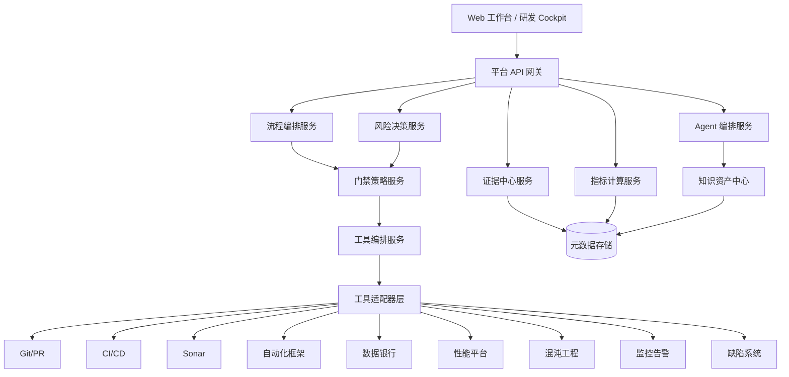
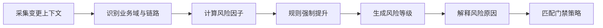
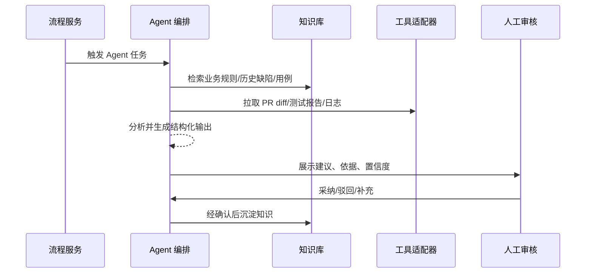
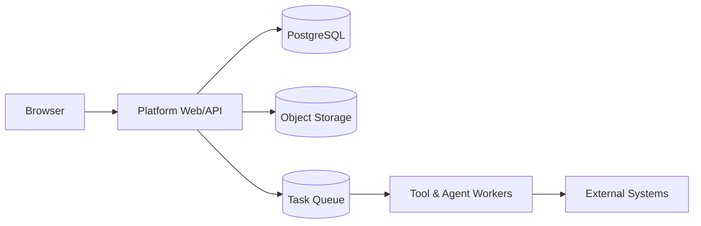

# AI 时代研发协同与质量工程平台技术架构设计

版本：v1.0  
关联主文档：[AI 时代研发协同与质量工程平台整体设计文档](ai-dev-collaboration-platform-design.md)

## 1. 架构目标

平台技术架构需要支撑：

- 统一变更视图。
- 可配置流程编排。
- 风险分级与门禁策略。
- 多工具接入与任务编排。
- AI Agent 编排与审计。
- 证据中心与研发经营指标。
- 面向核心链路的可扩展推广。

## 2. 逻辑架构



## 3. 服务拆分

| 服务 | 职责 | 关键接口 |
| --- | --- | --- |
| API 网关 | 统一鉴权、路由、限流、审计 | `/api/changes`, `/api/gates`, `/api/reports` |
| 变更服务 | 管理 change、状态、责任人、关联对象 | 创建、查询、更新、关联 PR/需求/发布 |
| 流程编排服务 | 按状态机推进阶段 | 启动流程、推进状态、阻断、例外审批 |
| 风险决策服务 | 计算风险评分和等级 | 风险计算、风险解释、人工调整 |
| 门禁策略服务 | 根据风险等级生成门禁清单 | 获取门禁、校验门禁、生成结论 |
| 工具编排服务 | 创建和追踪外部工具任务 | 触发任务、查询状态、收集报告 |
| 工具适配器 | 对接具体工具系统 | Git、Sonar、CI、自动化、监控等适配器 |
| Agent 编排服务 | 管理 Agent 触发、上下文、输出 | 触发分析、记录输出、人工反馈 |
| 证据中心服务 | 管理证据索引、状态、报告 URI | 上传证据、查询证据、证据完整度 |
| 指标服务 | 聚合效率、质量、稳定性指标 | 计算指标、下钻、趋势 |
| 知识资产服务 | 维护业务规则、链路、缺陷、用例资产 | 检索、写入、版本化 |

## 4. 数据存储设计

### 4.1 存储选择

| 数据类型 | 建议存储 | 说明 |
| --- | --- | --- |
| 变更、流程、审批、门禁 | 关系型数据库 | 强一致、可审计 |
| 证据索引、报告元数据 | 关系型数据库 + 对象存储 URI | 原始报告保留在源系统或对象存储 |
| Agent 输出、知识条目 | 文档数据库或关系型 JSON 字段 | 便于存储结构化和半结构化结果 |
| 指标明细 | 时序/OLAP 存储 | 支撑趋势、聚合、下钻 |
| 搜索 | OpenSearch/向量检索 | 支撑知识库和历史缺陷检索 |

### 4.2 核心表

```text
changes(
  id, title, business_domain, requirement_id, pr_id, owner,
  risk_level, risk_score, status, gate_status,
  ai_assisted, ai_generated_ratio,
  created_at, updated_at
)

risk_factors(
  id, change_id, factor_type, score, reason, source
)

gate_results(
  id, change_id, gate_name, required, status, evidence_id, reason
)

evidence(
  id, change_id, type, source_system, status, uri, summary, created_at
)

agent_runs(
  id, change_id, agent_name, input_ref, output_summary,
  confidence, decision, human_feedback, created_at
)

tool_runs(
  id, change_id, tool_type, external_task_id, status,
  report_uri, metrics_json, created_at, finished_at
)

approvals(
  id, change_id, approval_type, approver, decision, reason, created_at
)

knowledge_items(
  id, type, business_domain, title, content, source_ref, version, status
)
```

## 5. 风险决策实现

### 5.1 输入来源

- PR diff 文件路径、代码行数、服务名。
- 需求业务域、验收标准。
- 服务链路映射。
- 历史缺陷和线上告警。
- Sonar、覆盖率、自动化覆盖数据。
- AI 使用说明和 AI 生成比例。
- 发布保护能力：灰度、回滚、监控。

### 5.2 评分流程



强制提升规则示例：

- 涉及订单、优惠、库存、支付，最低 L3。
- 涉及金额批量修正、不可逆数据变更，最低 L4。
- 缺少回滚方案且触达核心链路，最低 L3。
- 同模块近 30 天存在 P1/P2 线上缺陷，风险提升一级。

## 6. Agent 编排设计

### 6.1 Agent 生命周期



### 6.2 安全控制

- Agent 只能读授权范围内的数据。
- Agent 工具调用必须记录审计日志。
- Agent 输出不直接改变门禁策略。
- 生产发布放行必须有人类审批。
- Prompt、上下文、输出摘要、人工反馈要可追溯。

## 7. 工具适配器设计

适配器统一接口：

```text
ToolAdapter:
  trigger(change_context, task_policy) -> tool_run_id
  poll(tool_run_id) -> status
  collect(tool_run_id) -> evidence
  normalize(raw_report) -> normalized_metrics
```

适配器返回统一结构：

```json
{
  "tool_type": "api_automation",
  "status": "passed",
  "report_uri": "https://...",
  "metrics": {
    "pass_rate": 96,
    "failed_cases": 3,
    "duration_seconds": 820
  },
  "blocking_findings": []
}
```

## 8. API 设计草案

```text
POST   /api/changes
GET    /api/changes/{id}
PATCH  /api/changes/{id}
POST   /api/changes/{id}/risk/evaluate
POST   /api/changes/{id}/gates/evaluate
POST   /api/changes/{id}/tools/{tool_type}/trigger
GET    /api/changes/{id}/evidence
POST   /api/changes/{id}/evidence
POST   /api/changes/{id}/agents/{agent_name}/run
POST   /api/changes/{id}/approvals
GET    /api/cockpit/metrics
GET    /api/reports/{change_id}
```

## 9. 权限模型

| 角色 | 权限 |
| --- | --- |
| Admin | 平台配置、规则配置、用户管理 |
| Engineering Lead | 查看团队变更、风险调整、发布审批 |
| Developer | 创建变更、提交证据、查看门禁 |
| QA Lead | 配置测试门禁、确认测试策略、查看质量指标 |
| QA Engineer | 提交测试证据、补充探索测试结论 |
| Release Manager | 发布准入、灰度、回滚、监控确认 |
| Business UAT | 查看业务证据、提交 UAT 结论 |
| Viewer | 只读查看 |

## 10. 部署架构

MVP 可采用单体后端 + 模块化服务边界，降低初期复杂度：



演进阶段可拆分为独立微服务：

- 变更服务。
- 流程服务。
- 风险服务。
- Agent 服务。
- 工具编排服务。
- 指标服务。

## 11. 可观测性

平台自身必须具备：

- API 请求量、延迟、错误率。
- Agent 调用成功率、耗时、采纳率。
- 工具任务触发成功率、失败率。
- 门禁误杀率、漏放率。
- 报告生成耗时。
- 队列积压。

## 12. 技术风险

| 风险 | 应对 |
| --- | --- |
| 外部工具接口不稳定 | 适配器隔离、重试、降级、手工证据补录 |
| 风险评分不准 | 规则解释、人工调整、复盘校准 |
| Agent 输出质量不稳定 | 限定输入、结构化输出、人工反馈闭环 |
| 数据孤岛 | 先接核心系统，逐步扩大 |
| 平台性能瓶颈 | 报告和工具任务异步化 |

