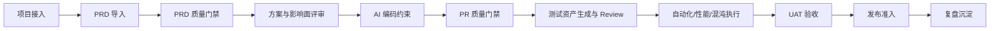

# OpenSDLC AI Quality Platform PRD

版本：v1.0
定位：面向开源社区和企业内网二次开发的 AI Coding 全生命周期质量门禁平台

## 1. 产品目标

OpenSDLC AI Quality Platform 要解决的问题不是“展示质量指标”，而是让 AI Coding 产生的大量变更可以被标准化接入、风险分级、自动验证、证据沉淀和持续复盘。

核心目标：

1. 让一个新项目从 PRD 导入到发布准入的关键流程可以在本地完整跑通。
2. 提供 PRD 质量门禁、PR 质量门禁、测试资产门禁、发布准入门禁的可执行样板。
3. 为 Git、SonarQube、CI、自动化测试、测试数据、性能、混沌、缺陷、监控等外部系统预留 Adapter 接口。
4. 让 8 个 SDLC 阶段 Agent 都具备可维护的 Skills、工具权限、输入输出契约、评测样例和审计记录。
5. 采用开源友好的零依赖本地版本作为参考实现，同时保留迁移到企业级架构的清晰边界。

## 2. 目标用户

| 用户 | 需求 |
| --- | --- |
| 测试工程师/质量工程师 | 配置质量门禁、生成测试资产、评审用例、触发自动化、沉淀证据 |
| 开发工程师 | 在 PR 阶段看到 Sonar、覆盖率、AI 生成比例、影响面和必跑测试 |
| 产品经理 | 导入 PRD，确认业务规则卡、验收标准和歧义点 |
| 架构师/研发负责人 | 评估跨系统影响、回滚、容量、依赖和发布风险 |
| 开源贡献者 | 本地启动、理解模块边界、扩展 Adapter 和 Agent Skill |

## 3. 开源版本范围

### 3.1 必须支持

- 本地一条命令启动。
- 内置 Mock 数据，可完整演练一个大型项目。
- PRD 多源导入：文件、粘贴文本、飞书/Confluence/Jira/URL 链接登记。
- PRD 质量门禁：规则卡完整性、验收标准、歧义点、风险提示。
- 多系统、多仓库项目建模。
- PR 质量门禁：PR 登记、Sonar 模拟拉取、AI 生成比例、变更规模、阻断原因。
- 测试资产：Agent 生成候选用例、QA Review、退回、批准入库、自动化绑定。
- 测试执行：自动化模拟执行，结果归一化为证据。
- 发布准入：汇总 PR、测试、证据、阻断项，输出准入结论。
- Agent 运维：8 个阶段 Agent 的 Prompt、Skills、工具权限、策略、评测样例可查看和维护。
- 集成中心：展示外部系统 Adapter 模式，并支持健康检查、同步、ToolRun、Webhook 模拟。
- Runbook：一键或逐步运行端到端流程。

### 3.2 暂不支持

- 真实账号体系、SSO 和租户隔离。
- 真实 Git/Sonar/CI 网络调用。
- AI 大模型真实调用。
- 生产级数据库、队列、对象存储部署。

开源版本用 Mock Adapter 和本地 JSON 状态模拟生产系统。真实企业落地时按技术方案替换 Adapter 和存储层。

## 4. 核心流程

## 5. 门禁定义

| 阶段 | 门禁 | 通过条件 | 阻断条件 |
| --- | --- | --- | --- |
| PRD | 需求质量门禁 | 业务目标、规则、验收标准、风险提示已识别，歧义点可追踪 | 缺少验收标准、存在未确认核心歧义、规则不可测试 |
| 方案 | 影响面门禁 | 多系统、多仓库、接口契约、回滚、容量风险已确认 | L3/L4 缺少系统 Owner、契约未冻结、无回滚策略 |
| PR | 代码质量门禁 | Sonar 通过，覆盖率不低于基线，AI 变更已说明，Review 完成 | Sonar ERROR、AI 生成比例高但无自检、核心文件缺测试 |
| 测试 | 测试资产门禁 | P0/P1 用例已 Review，核心链路已绑定自动化，执行结果可追溯 | 候选用例未 Review、关键场景无自动化或失败未归因 |
| 发布 | 发布准入门禁 | 证据完整、阻断项关闭、灰度和回滚可执行 | PR/自动化/UAT/回滚任一关键证据缺失 |

## 6. 8 个阶段 Agent 与 Skills

| 阶段 | Agent | 必挂 Skills |
| --- | --- | --- |
| 需求澄清 | Requirement Agent | PRD 解析、规则卡抽取、歧义识别、验收标准检查、版本差异 |
| 方案评审 | Architecture Agent | 影响面分析、接口契约、数据一致性、容量、回滚 |
| AI 编码 | Coding Agent | 代码上下文、编码约束、单测建议、影响面标注、自检清单 |
| PR 门禁 | PR Diff Agent | Diff 风险、Sonar 汇聚、覆盖率比对、AI 生成比例、必跑测试 |
| 测试验证 | Test Orchestration Agent | 测试策略、用例生成、数据银行、自动化推荐、覆盖缺口 |
| UAT 验收 | UAT Agent | 业务验收清单、验收证据、业务反馈、遗留风险 |
| 发布决策 | Release Agent | 证据完整性、灰度、回滚、审批、发布报告 |
| 复盘沉淀 | Retrospective Agent | 缺陷模式、门禁调优、评测样例、知识库、组织指标 |

## 7. 开源验收标准

1. 用户克隆仓库后可以在本地启动平台。
2. 用户可以进入“开源运行台”，逐步或一键完成端到端流程。
3. 每一步都产生可见状态、证据或审计日志。
4. 用户可以查看每个 Agent 的 Skills、工具权限和评测样例。
5. 用户可以通过 Mock Adapter 看到未来对接真实工具时的对象和字段。
6. 文档明确说明如何从本地样板迁移到企业级生产架构。
