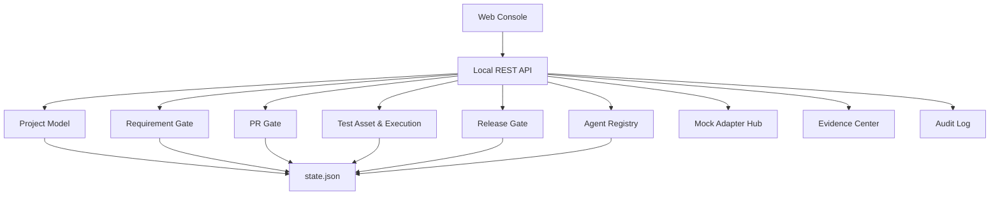

# OpenSDLC AI Quality Platform 技术方案

版本：v1.0
关联 PRD：[OpenSDLC AI Quality Platform PRD](open-source-ai-quality-platform-prd.md)

## 1. 技术目标

开源版本采用“本地可运行参考实现 + 企业级扩展边界”的设计。第一阶段不追求复杂部署，而是确保全流程可执行、模型清晰、接口稳定、Adapter 可替换、Agent Skill 可治理。

## 2. 架构分层

## 3. 本地实现

| 层 | 当前实现 | 后续生产替换 |
| --- | --- | --- |
| 前端 | 原生 HTML/CSS/JS | React + TypeScript + Router |
| 后端 | Python ThreadingHTTPServer | Java 21 + Spring Boot 3 |
| 存储 | JSON 文件 | PostgreSQL + Redis + Object Storage |
| 外部系统 | Mock Adapter | GitHub/GitLab、SonarQube、Jenkins、自动化平台 API |
| Agent | 配置与模拟运行 | LLM Gateway + Tool Calling + Eval |
| 门禁 | Python 内置规则 | 规则引擎 + 策略版本化 |

## 4. 核心数据对象

| 对象 | 说明 |
| --- | --- |
| Project | 大型项目质量空间，支持多个系统和仓库 |
| RequirementSource | PRD 来源，包含文件、文本、飞书、Confluence、Jira、URL |
| RequirementRuleCard | 需求规则卡，包含规则、验收、歧义和风险 |
| PullRequest | PR 门禁对象，必须归属于项目、系统、仓库 |
| SonarResult | 静态扫描与质量门禁结果 |
| TestCase | 测试资产，支持候选、Review、入库、自动化绑定 |
| TestExecution | 自动化、性能、混沌执行记录 |
| Evidence | 所有门禁消费的统一证据索引 |
| AgentDefinition | Agent 配置，包含 Skills、Prompt、工具权限和评测 |
| AgentRun | Agent 执行记录和审计 |
| Integration | 外部系统 Adapter 配置 |
| RunbookStep | 开源端到端演练步骤 |

## 5. 可执行 Runbook API

| API | 说明 |
| --- | --- |
| `GET /api/runbook` | 返回开源演练步骤、当前完成状态和门禁摘要 |
| `POST /api/projects/{projectId}/runbook/run-step` | 执行单个步骤 |
| `POST /api/projects/{projectId}/runbook/run-all` | 一键执行端到端流程 |
| `GET /api/agent-skills` | 返回 8 个阶段 Agent Skills |
| `GET /api/open-source-blueprint` | 返回开源项目定位、模块和扩展点 |

## 6. 门禁规则实现

### 6.1 PRD 质量门禁

输入：

- PRD 文本或链接元数据。
- 项目系统和仓库。
- 业务域和风险等级。

规则：

- 必须识别业务目标。
- 必须至少有一条业务规则。
- 必须至少有一条验收标准。
- L3/L4 必须有风险提示。
- 存在核心歧义时进入 `manual_review`，不能直接放行。

输出：

- 需求规则卡。
- PRD 门禁结论。
- 证据记录。
- 审计日志。

### 6.2 PR 质量门禁

输入：

- PR 基础信息、仓库、系统、变更文件数、AI 生成比例。
- Sonar Quality Gate、覆盖率、问题数量。

规则：

- Sonar `ERROR` 阻断。
- AI 生成比例 >= 60% 时要求加强 Review 和单测证据。
- 变更文件数 >= 20 时要求影响面说明。
- L3/L4 项目必须生成必跑测试建议。

输出：

- PR 门禁状态。
- 风险摘要。
- Sonar 证据。
- 推荐测试集。

### 6.3 测试资产门禁

规则：

- P0/P1 候选用例必须经过 Review。
- 核心链路 P0 用例必须入库。
- 可自动化的 P0 用例必须绑定自动化套件。
- 自动化失败必须形成阻断或人工豁免。

### 6.4 发布准入门禁

规则：

- 存在 PR 阻断则发布阻断。
- 存在自动化失败则发布阻断。
- L3/L4 缺少自动化执行证据则发布阻断。
- L4 默认进入人工审批。

## 7. Agent Skill 挂载规范

每个 Skill 包含：

- `id`：稳定标识。
- `name`：能力名称。
- `stage`：所属阶段。
- `description`：能力边界。
- `inputs`：需要的上下文。
- `outputs`：输出对象。
- `tools`：允许调用的工具。
- `quality_rules`：必须遵守的门禁规则。
- `eval_cases`：评测样例。

Agent 不直接拥有无限上下文。平台按阶段和项目最小授权提供上下文，并记录每次运行的输入摘要、工具调用和输出结论。

## 8. Adapter 扩展规范

真实企业接入时，新增 Adapter 需要实现：

1. `health_check()`：健康检查。
2. `sync()`：主动拉取外部对象。
3. `handle_webhook()`：处理外部事件。
4. `trigger()`：触发外部任务。
5. `normalize()`：转成平台标准对象或 Evidence。

当前本地版本用 Mock Adapter 保持相同对象模型，便于后续替换。

## 9. 开发落地顺序

1. 保留本地零依赖版本作为开源体验入口。
2. 补充 Runbook 页面和 API，保证所有流程可执行。
3. 补充 Agent Skill Catalog，让每个 Agent 的能力可维护。
4. 补充 README，说明启动、演练、扩展 Adapter、扩展 Agent。
5. 后续再拆分为 React/Spring Boot/PostgreSQL 生产版本。
