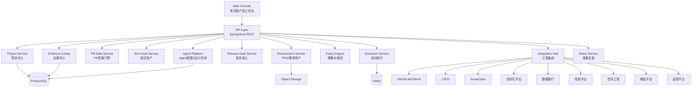
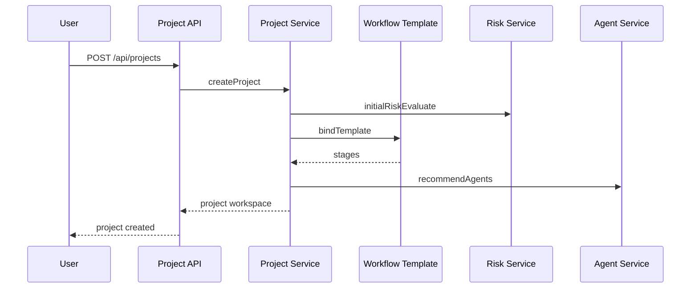
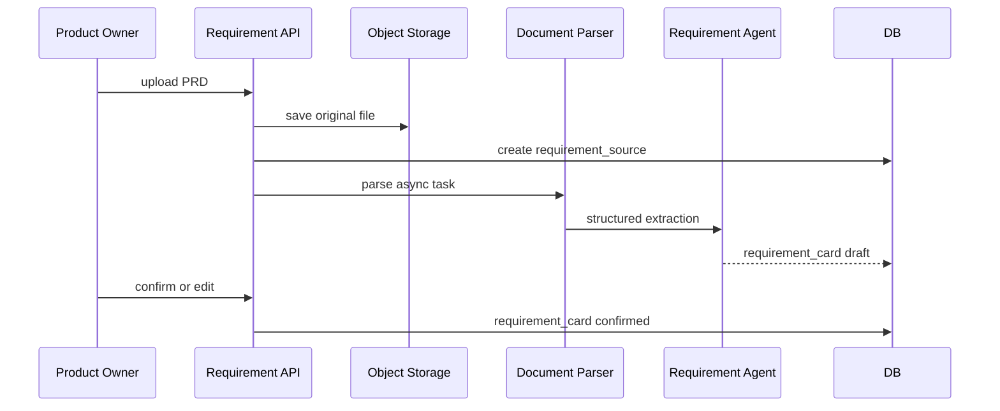
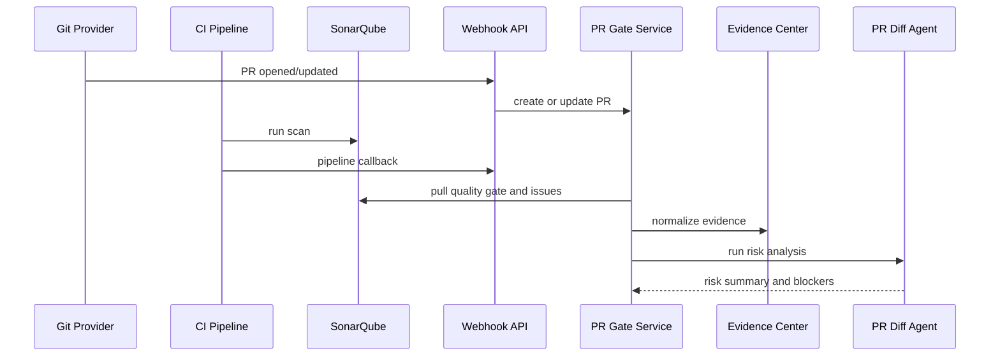
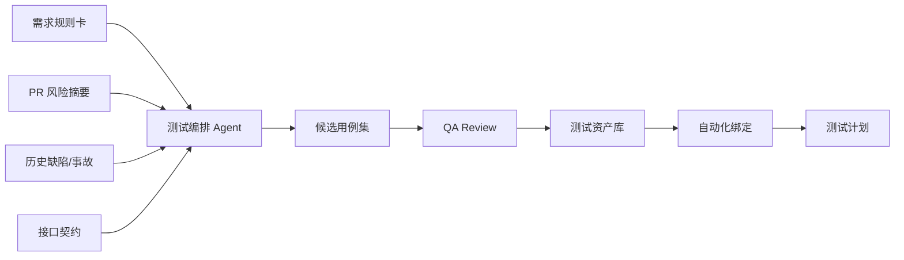
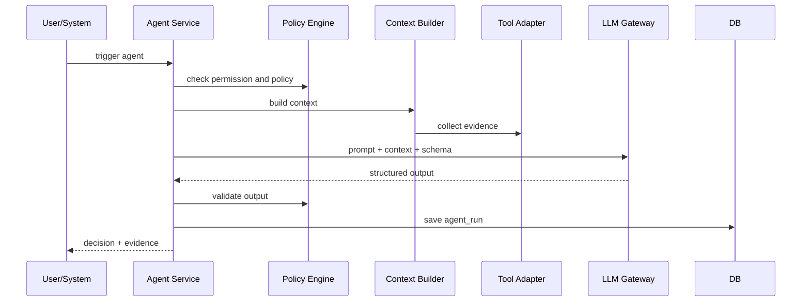
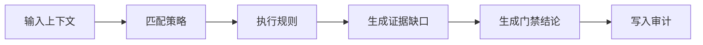
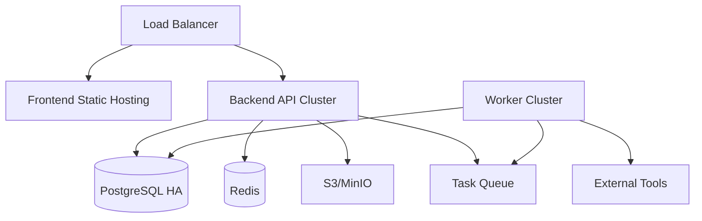

# AI Coding 时代研发质量保障平台技术方案设计

版本：v1.0  
日期：2026-06-11  
关联文档：[产品级设计文档](product-grade-ai-quality-platform-design.md)

## 1. 技术方案目标

本技术方案用于把当前 Demo 级系统重构为产品级应用，支撑大型项目从 PRD 导入、需求解析、PR 质量门禁、Sonar 汇聚、测试用例生成、自动化测试执行、发布准入到复盘沉淀的完整闭环。

平台需要满足：

- 年度数百项目接入和并行流转。
- 多角色协同与权限隔离。
- 多工具集成与证据归一化。
- Agent 可配置、可评测、可审计、可灰度、可回滚。
- 所有质量门禁有证据、有结论、有责任人、有审计日志。

## 2. 总体架构

### 2.1 架构风格

建议采用模块化单体优先，保留服务化边界。

第一阶段不建议一开始拆成大量微服务。原因是平台核心复杂度在业务流程、证据模型、工具集成和 Agent 编排，而不是单点吞吐。模块化单体可以降低早期开发和部署复杂度，同时通过清晰包结构和接口边界，为后续拆分服务留空间。

### 2.2 技术栈

| 层级 | 推荐技术 | 说明 |
| --- | --- | --- |
| 前端 | React + TypeScript + React Router | 多页面产品应用 |
| 状态与请求 | TanStack Query | 数据缓存、接口状态、重试 |
| 表格 | TanStack Table | 项目、PR、用例、执行记录 |
| 表单 | React Hook Form + Zod | 新建项目、Agent 配置、集成配置 |
| 图表 | ECharts | 项目组合、风险、质量趋势 |
| 后端 | Java 21 + Spring Boot 3 | 企业级后端主框架 |
| ORM | MyBatis Plus 或 JPA | 推荐 MyBatis Plus，便于复杂 SQL 和报表 |
| 数据库 | PostgreSQL | 业务主库，支持 JSONB |
| 缓存 | Redis | 任务状态、幂等、短期锁 |
| 对象存储 | MinIO/S3 | PRD、报告、附件、自动化结果归档 |
| 异步任务 | Spring Scheduler + Quartz，后续可接 Temporal | 工具拉取、报告生成、Agent 任务 |
| API 文档 | OpenAPI/Swagger | 接口契约 |
| 权限 | SSO/OIDC + RBAC | 企业身份体系 |
| 审计 | DB Audit Log + 操作日志 | 合规追溯 |

### 2.3 逻辑架构



## 3. 后端模块设计

### 3.1 模块划分

建议后端工程按以下模块组织：

```text
ai-quality-platform
  platform-api                  // REST Controller
  platform-auth                 // SSO/RBAC/权限
  platform-project              // 项目中心
  platform-requirement          // PRD导入与需求资产
  platform-pr-gate              // PR质量门禁
  platform-test-asset           // 测试用例/测试计划
  platform-test-execution       // 自动化/性能/混沌执行结果
  platform-release-gate         // 发布准入
  platform-agent                // Agent管理/运行/评测
  platform-policy               // 策略规则引擎
  platform-integration          // 工具集成适配器
  platform-evidence             // 证据中心
  platform-metric               // 度量与复盘
  platform-common               // 通用模型、异常、工具
```

### 3.2 模块职责

| 模块 | 职责 | 关键对象 |
| --- | --- | --- |
| Project | 项目台账、阶段流程、角色、风险等级 | Project、ProjectMember、ProjectStage |
| Requirement | PRD 上传、解析、需求规则卡、歧义确认 | Requirement、RequirementSource、RequirementRule |
| PR Gate | PR 接入、Sonar/覆盖率/Review 汇聚、门禁结论 | PullRequest、PrCheck、PrGateResult |
| Test Asset | 测试计划、测试用例、自动化绑定、数据任务 | TestPlan、TestCase、DataTask |
| Test Execution | 自动化、性能、混沌执行记录和结果归一化 | TestExecution、ExecutionCaseResult |
| Release Gate | 发布准入、灰度、回滚、审批、报告 | ReleaseGate、ReleaseApproval |
| Agent | Agent 配置、版本、试运行、评测、执行记录 | AgentDefinition、AgentRun、AgentEvalCase |
| Policy | 风险分级、门禁策略、例外策略 | Policy、PolicyRule、PolicyResult |
| Integration | 外部系统配置、Webhook、API 拉取 | Integration、WebhookEvent、ToolRun |
| Evidence | 证据索引、证据完整度、报告引用 | Evidence、EvidenceLink |
| Metric | 年度项目组合、质量趋势、复盘指标 | MetricSnapshot、RetroItem |

## 4. 前端应用设计

### 4.1 页面结构

采用产品级多页面布局：

```text
AppShell
  Sidebar
  Header(Project Context + User)
  MainContent
```

一级导航：

- Dashboard：首页驾驶舱
- Projects：项目中心
- Requirements：需求与 PRD
- Pull Requests：PR 质量门禁
- Test Assets：测试资产中心
- Test Executions：测试执行中心
- Release Gates：发布准入
- Agents：Agent 管理
- Integrations：集成中心
- Policies：策略与规则
- Metrics：度量与复盘
- Admin：系统管理

### 4.2 页面路由

```text
/dashboard
/projects
/projects/new
/projects/:projectId/overview
/projects/:projectId/stages
/projects/:projectId/requirements
/projects/:projectId/prs
/projects/:projectId/test-cases
/projects/:projectId/test-plans
/projects/:projectId/executions
/projects/:projectId/release-gate
/projects/:projectId/evidence
/agents
/agents/:agentId
/integrations
/policies
/metrics
```

### 4.3 前端状态设计

- 全局状态：用户、权限、当前项目上下文。
- 服务端状态：使用 TanStack Query 管理。
- 表单状态：React Hook Form + Zod。
- 页面过滤器：URL query 参数保存，方便分享和回溯。

## 5. 核心数据模型

### 5.1 项目模型

```sql
create table project (
  id varchar(64) primary key,
  name varchar(256) not null,
  business_domain varchar(128) not null,
  project_type varchar(64) not null,
  risk_level varchar(16) not null,
  status varchar(32) not null,
  owner_id varchar(64) not null,
  product_owner_id varchar(64),
  dev_owner_id varchar(64),
  qa_owner_id varchar(64),
  uat_owner_id varchar(64),
  repo_url varchar(512),
  start_date date,
  end_date date,
  template_id varchar(64),
  created_at timestamp not null,
  updated_at timestamp not null
);
```

### 5.1.1 项目系统与多仓库模型

大型项目必须支持一个项目关联多个系统和多个仓库。系统、仓库、PR 之间不能被简化为单一 `repo_url`。

```sql
create table project_system (
  id varchar(64) primary key,
  project_id varchar(64) not null,
  system_name varchar(256) not null,
  business_domain varchar(128),
  owner_id varchar(64),
  criticality varchar(32),
  upstream_systems_json jsonb,
  downstream_systems_json jsonb,
  cmdb_id varchar(128),
  created_at timestamp not null,
  updated_at timestamp not null
);

create table project_repository (
  id varchar(64) primary key,
  project_id varchar(64) not null,
  system_id varchar(64),
  repo_name varchar(256) not null,
  repo_url varchar(512) not null,
  default_branch varchar(128),
  code_owner_id varchar(64),
  ci_pipeline_ref varchar(256),
  sonar_project_key varchar(256),
  enabled boolean not null default true,
  created_at timestamp not null,
  updated_at timestamp not null
);

create table project_stakeholder (
  id varchar(64) primary key,
  project_id varchar(64) not null,
  role_code varchar(64) not null,
  user_id varchar(64) not null,
  approval_scope varchar(256),
  required_for_risk_levels_json jsonb,
  created_at timestamp not null
);
```

技术要求：

- `project` 是质量空间，`project_system` 是系统影响面，`project_repository` 是代码入口。
- PR 必须关联 `project_repository`，不能只关联项目。
- 质量门禁需要按项目汇总，也要能下钻到系统和仓库。
- L3/L4 项目至少需要系统 Owner、QA Owner、发布经理；L4 还需要架构 Owner 或质量委员会角色。

### 5.2 项目阶段模型

```sql
create table project_stage (
  id varchar(64) primary key,
  project_id varchar(64) not null,
  stage_code varchar(64) not null,
  stage_name varchar(128) not null,
  agent_id varchar(64),
  owner_role varchar(64),
  status varchar(32) not null,
  gate_status varchar(32),
  started_at timestamp,
  finished_at timestamp,
  blocker_count int default 0
);
```

### 5.3 PRD/需求模型

```sql
create table requirement_source (
  id varchar(64) primary key,
  project_id varchar(64) not null,
  source_type varchar(32) not null,
  file_name varchar(256),
  file_uri varchar(512),
  external_url varchar(512),
  external_provider varchar(64),
  external_doc_id varchar(256),
  source_version varchar(128),
  content_hash varchar(128),
  parse_status varchar(32) not null,
  uploaded_by varchar(64),
  created_at timestamp not null
);

create table requirement_card (
  id varchar(64) primary key,
  project_id varchar(64) not null,
  source_id varchar(64),
  business_goal text,
  rules_json jsonb,
  acceptance_criteria_json jsonb,
  ambiguity_json jsonb,
  risk_hint_json jsonb,
  status varchar(32) not null,
  confirmed_by varchar(64),
  confirmed_at timestamp,
  created_at timestamp not null
);
```

### 5.3.1 PRD 导入技术能力

PRD 导入需要抽象为 `RequirementSourceAdapter`，避免把不同来源写死在业务代码里。

```java
public interface RequirementSourceAdapter {
    String sourceType();
    SourceFetchResult fetch(RequirementSourceConfig config);
    ParsedDocument parse(SourceFetchResult source);
    RequirementCard extract(ParsedDocument document, AgentContext context);
}
```

适配器类型：

- `text_adapter`：粘贴文本。
- `markdown_adapter`：Markdown 文件。
- `docx_adapter`：Word 文件，使用 Apache POI。
- `pdf_adapter`：PDF 文件，使用 PDFBox。
- `url_adapter`：普通 URL，登记链接并抓取可访问内容。
- `feishu_adapter`：飞书文档，通过文档 token 拉取内容。
- `confluence_adapter`：Confluence 页面。
- `jira_adapter`：Jira Issue。

PRD 解析必须输出：

- 原文片段引用 `source_spans`。
- 解析置信度 `confidence`。
- 歧义清单 `ambiguities`。
- 需求规则卡草稿。
- 影响系统初判。
- 测试点初判。

飞书文档接入要求：

- 从 URL 中解析文档 token。
- 使用服务账号或 OAuth 授权读取文档。
- 记录权限失败、文档不存在、文档变更等状态。
- 拉取内容后保存快照 hash，用于识别 PRD 版本变化。

### 5.4 PR 与 Sonar 模型

```sql
create table pull_request (
  id varchar(64) primary key,
  project_id varchar(64) not null,
  provider varchar(32) not null,
  repository_id varchar(64),
  system_id varchar(64),
  external_id varchar(128) not null,
  title varchar(512),
  author varchar(128),
  source_branch varchar(256),
  target_branch varchar(256),
  url varchar(512),
  status varchar(32),
  ai_generated_ratio numeric(5,2),
  created_at timestamp,
  updated_at timestamp
);

create table sonar_result (
  id varchar(64) primary key,
  pr_id varchar(64) not null,
  project_key varchar(256),
  quality_gate_status varchar(32),
  bugs int,
  vulnerabilities int,
  code_smells int,
  coverage numeric(6,2),
  duplicated_lines_density numeric(6,2),
  blocker_issues_json jsonb,
  critical_issues_json jsonb,
  raw_report_uri varchar(512),
  collected_at timestamp not null
);
```

PR 多仓库处理要求：

- `pull_request.repository_id` 必须关联仓库。
- PR Diff Agent 需要读取同项目下其他未完成 PR，识别跨仓库联动风险。
- 同一项目多个 PR 的门禁状态需要汇总到项目发布准入。
- Sonar 结果按 `repository_id + pr_id` 归档，避免不同仓库 projectKey 混淆。

### 5.5 测试资产模型

```sql
create table test_case (
  id varchar(64) primary key,
  project_id varchar(64) not null,
  requirement_id varchar(64),
  title varchar(512) not null,
  case_type varchar(32) not null,
  priority varchar(16) not null,
  risk_level varchar(16),
  precondition text,
  steps_json jsonb,
  expected_result text,
  test_data_refs_json jsonb,
  automation_framework varchar(128),
  automation_suite varchar(128),
  automation_case_key varchar(128),
  source_type varchar(32),
  status varchar(32) not null,
  created_by varchar(64),
  reviewed_by varchar(64),
  created_at timestamp not null,
  updated_at timestamp not null
);

create table test_plan (
  id varchar(64) primary key,
  project_id varchar(64) not null,
  name varchar(256) not null,
  scope_json jsonb,
  case_ids_json jsonb,
  data_task_ids_json jsonb,
  status varchar(32) not null,
  created_by varchar(64),
  created_at timestamp not null
);
```

### 5.6 自动化执行模型

```sql
create table test_execution (
  id varchar(64) primary key,
  project_id varchar(64) not null,
  plan_id varchar(64),
  execution_type varchar(32) not null,
  external_task_id varchar(128),
  suite varchar(256),
  triggered_by varchar(64),
  total_count int,
  passed_count int,
  failed_count int,
  skipped_count int,
  status varchar(32) not null,
  report_url varchar(512),
  logs_url varchar(512),
  started_at timestamp,
  finished_at timestamp
);

create table test_execution_case_result (
  id varchar(64) primary key,
  execution_id varchar(64) not null,
  case_id varchar(64),
  case_key varchar(128),
  status varchar(32) not null,
  failure_reason text,
  defect_id varchar(64),
  raw_json jsonb
);
```

### 5.7 Agent 模型

```sql
create table agent_definition (
  id varchar(64) primary key,
  name varchar(128) not null,
  agent_type varchar(32) not null,
  stage_code varchar(64),
  role_code varchar(64),
  version varchar(32) not null,
  status varchar(32) not null,
  owner_role varchar(128),
  system_prompt text,
  input_schema_json jsonb,
  output_schema_json jsonb,
  tool_permissions_json jsonb,
  policy_rules_json jsonb,
  eval_cases_json jsonb,
  runtime_json jsonb,
  created_at timestamp not null,
  updated_at timestamp not null
);

create table agent_run (
  id varchar(64) primary key,
  project_id varchar(64),
  agent_id varchar(64) not null,
  trigger_type varchar(64),
  input_ref varchar(256),
  output_json jsonb,
  decision varchar(64),
  confidence numeric(5,2),
  status varchar(32) not null,
  started_at timestamp,
  finished_at timestamp,
  human_feedback_json jsonb
);
```

### 5.7.1 Agent 背后能力模型

AgentDefinition 只描述 Agent 自身配置，不足以支撑产品级运行。需要补充 Agent 能力、工具权限、上下文策略和评测结果。

```sql
create table agent_capability (
  id varchar(64) primary key,
  agent_id varchar(64) not null,
  capability_code varchar(128) not null,
  capability_name varchar(256) not null,
  description text,
  required_data_json jsonb,
  required_tools_json jsonb,
  required_permissions_json jsonb,
  human_checkpoint varchar(256),
  enabled boolean not null default true
);

create table agent_tool_permission (
  id varchar(64) primary key,
  agent_id varchar(64) not null,
  integration_type varchar(64) not null,
  permission_level varchar(32) not null,
  approval_required boolean not null default false,
  scope_json jsonb,
  created_at timestamp not null
);

create table agent_eval_result (
  id varchar(64) primary key,
  agent_id varchar(64) not null,
  agent_version varchar(32) not null,
  eval_case_id varchar(64) not null,
  status varchar(32) not null,
  expected text,
  actual text,
  score numeric(5,2),
  evaluated_at timestamp not null
);

create table agent_context_policy (
  id varchar(64) primary key,
  agent_id varchar(64) not null,
  context_scope varchar(64) not null,
  allowed_entities_json jsonb,
  denied_entities_json jsonb,
  max_tokens int,
  pii_masking_required boolean not null default true
);
```

各 Agent 后台能力要求：

| Agent | 后台能力服务 | 必要数据服务 | 工具适配器 | 输出校验 |
| --- | --- | --- | --- | --- |
| 需求澄清 Agent | Document Parser、Requirement Extractor、Source Span Index | RequirementSource、RequirementCard、KnowledgeItem | Feishu/Confluence/Jira Adapter | 必须包含原文引用、歧义点、验收标准 |
| 方案评审 Agent | Impact Analyzer、Dependency Graph、Contract Diff | ProjectSystem、Repository、API Contract、Data Lineage | CMDB、接口平台、数据血缘 | 必须列出影响系统、Owner、风险原因 |
| Coding Agent | Code Context Builder、Code Policy Checker | RequirementCard、Solution、Repository | Git、CI、Unit Test | 不得越权修改模块，必须输出自检说明 |
| PR Diff Agent | Diff Analyzer、Sonar Collector、Risk Engine | PullRequest、SonarResult、Coverage、Defect | Git、Sonar、CI、SAST/SCA | 必须输出风险等级、阻断项、必跑测试 |
| 测试编排 Agent | Test Strategy Generator、Case Generator、Data Planner | RequirementCard、TestCase、HistoricalDefect | 数据银行、自动化、性能、混沌 | 必须输出测试计划、数据计划、自动化计划 |
| UAT Agent | UAT Package Builder、Business Sample Generator | AcceptanceCriteria、TestReport、RequirementRule | UAT、数据银行 | 不得替业务签收，必须列遗留风险 |
| 发布决策 Agent | Evidence Aggregator、Gate Evaluator、Approval Router | Evidence、ReleaseGate、Defect、Execution | 发布、监控、审批 | 阻断项未关闭不得输出 pass |
| 复盘沉淀 Agent | Root Cause Analyzer、Knowledge Writer、Eval Case Builder | Incident、Defect、AgentRun、Metric | 缺陷、监控、知识库 | 规则变更必须进入审批 |

### 5.7.2 Agent Context Builder

Agent 运行前必须通过 Context Builder 构造上下文，不能让 Agent 自由访问所有数据。

Context Builder 输入：

- 用户身份与角色。
- 项目 ID。
- Agent ID。
- 当前阶段。
- 允许的实体类型。
- 风险等级。

Context Builder 输出：

```json
{
  "project": {},
  "systems": [],
  "repositories": [],
  "requirements": [],
  "prs": [],
  "evidence": [],
  "policies": [],
  "permissions": [],
  "redactions": []
}
```

控制规则：

- 只注入当前项目授权数据。
- 敏感字段脱敏。
- L4 项目增加审批和审计上下文。
- 对外部工具只注入证据摘要，不直接暴露 Token。

### 5.8 证据与门禁模型

```sql
create table quality_evidence (
  id varchar(64) primary key,
  project_id varchar(64) not null,
  evidence_type varchar(64) not null,
  source_system varchar(64),
  source_id varchar(128),
  title varchar(256),
  summary text,
  metrics_json jsonb,
  uri varchar(512),
  status varchar(32) not null,
  collected_at timestamp not null
);

create table release_gate (
  id varchar(64) primary key,
  project_id varchar(64) not null,
  risk_level varchar(16) not null,
  decision varchar(32) not null,
  evidence_score numeric(5,2),
  blockers_json jsonb,
  approvals_json jsonb,
  report_uri varchar(512),
  evaluated_at timestamp not null
);
```

## 6. 关键业务流程技术设计

### 6.1 新项目创建



关键点：

- 创建项目时必须绑定流程模板。
- 风险初评可人工填写，也可根据业务域、项目类型、仓库、历史缺陷给出建议。
- L3/L4 自动添加架构 Owner、质量运营、发布经理角色。
- 项目创建必须支持批量维护系统清单、仓库清单、接口范围和工具映射。
- 系统清单和仓库清单需要支持后续变更，变更需记录审计。
- 新增仓库后需要触发集成检查：Git 访问、CI 配置、Sonar projectKey、代码 Owner。

### 6.2 PRD 导入



解析策略：

- Markdown：直接解析文本结构。
- Word：服务端用 Apache POI 提取文本和表格。
- PDF：第一阶段提取文本，复杂版式可进入人工确认。
- URL/飞书/Confluence/Jira：第一阶段登记链接，第二阶段通过 API 拉取。

产品级 PRD 导入状态机：

```text
created -> fetching -> parsed -> agent_extracted -> product_review -> confirmed
                         |             |
                         v             v
                       failed      need_clarification
```

关键审计：

- 谁导入了 PRD。
- 来源是什么。
- 是否有权限读取。
- Agent 抽取了哪些规则。
- 产品 Owner 修改了哪些内容。
- 何时确认进入开发。

### 6.3 PR 与 Sonar 汇聚



Sonar 集成原则：

- CI 负责执行扫描。
- 平台负责拉取、归一化、解释和纳入门禁。
- Sonar token 存储在 Secret 管理中，数据库只存 `secret_ref`。
- Sonar 原始报告可不落库，只保留 URI 和关键指标。

多仓库 Sonar 映射：

```text
Project -> Repository -> Sonar Project Key -> PR Analysis
```

每个仓库可以配置不同 Sonar projectKey。平台在拉取 Sonar 时需要通过 `repository_id` 找到集成配置，而不是使用项目级单一配置。

### 6.4 测试用例生成与维护



用例状态机：

```text
draft -> reviewed -> automated -> active -> deprecated
```

规则：

- Agent 只能生成候选用例。
- QA Review 后才能进入正式资产库。
- 自动化绑定必须记录 framework、suite、case_key。
- 线上逃逸缺陷必须反向生成或更新用例。

### 6.5 自动化测试集成

自动化平台建议接入两类模式：

1. 触发型：平台调用自动化平台 API 发起执行。
2. 回调型：CI 或自动化平台执行后回传结果。

统一适配器接口：

```java
public interface TestAutomationAdapter {
    ToolRun trigger(TestExecutionRequest request);
    ToolRunStatus query(String externalTaskId);
    TestExecutionResult collect(String externalTaskId);
}
```

执行结果归一化：

- total
- passed
- failed
- skipped
- pass_rate
- failed_cases
- report_url
- logs_url
- blocking_findings

## 7. API 设计

### 7.1 项目中心

```text
POST   /api/projects
GET    /api/projects
GET    /api/projects/{projectId}
PATCH  /api/projects/{projectId}
GET    /api/projects/{projectId}/stages
POST   /api/projects/{projectId}/risk/evaluate
```

### 7.2 PRD/需求

```text
POST   /api/projects/{projectId}/requirements/upload
POST   /api/projects/{projectId}/requirements/link
GET    /api/projects/{projectId}/requirements
GET    /api/requirements/{requirementId}
POST   /api/requirements/{requirementId}/parse
PATCH  /api/requirements/{requirementId}/card
POST   /api/requirements/{requirementId}/confirm
```

### 7.3 PR 门禁

```text
POST   /api/projects/{projectId}/prs/register
POST   /api/webhooks/git
POST   /api/webhooks/ci
GET    /api/projects/{projectId}/prs
GET    /api/prs/{prId}
POST   /api/prs/{prId}/collect-sonar
POST   /api/prs/{prId}/gate/evaluate
GET    /api/prs/{prId}/evidence
```

### 7.4 测试资产

```text
POST   /api/projects/{projectId}/test-cases/generate
POST   /api/projects/{projectId}/test-cases
GET    /api/projects/{projectId}/test-cases
GET    /api/test-cases/{caseId}
PATCH  /api/test-cases/{caseId}
POST   /api/test-cases/{caseId}/review
POST   /api/test-cases/{caseId}/bind-automation
```

### 7.5 测试执行

```text
POST   /api/projects/{projectId}/test-plans
GET    /api/projects/{projectId}/test-plans
POST   /api/test-plans/{planId}/execute
GET    /api/test-executions/{executionId}
POST   /api/webhooks/automation
POST   /api/test-executions/{executionId}/failure-analysis
```

### 7.6 Agent 管理

```text
GET    /api/agents
POST   /api/agents
GET    /api/agents/{agentId}
PUT    /api/agents/{agentId}
POST   /api/agents/{agentId}/evaluate
POST   /api/agents/{agentId}/simulate
POST   /api/agents/{agentId}/publish
POST   /api/agents/{agentId}/rollback
GET    /api/agent-runs
GET    /api/agent-runs/{runId}
```

### 7.7 集成中心

```text
POST   /api/integrations
GET    /api/integrations
GET    /api/integrations/{integrationId}
PATCH  /api/integrations/{integrationId}
POST   /api/integrations/{integrationId}/health-check
POST   /api/integrations/{integrationId}/test-connection
```

### 7.8 发布准入

```text
POST   /api/projects/{projectId}/release-gate/evaluate
GET    /api/projects/{projectId}/release-gate
POST   /api/projects/{projectId}/release-gate/approve
POST   /api/projects/{projectId}/release-gate/exception
GET    /api/projects/{projectId}/release-report
```

## 8. 集成适配器设计

### 8.1 统一适配器接口

```java
public interface IntegrationAdapter<I, O> {
    String type();
    HealthCheckResult healthCheck(IntegrationConfig config);
    O execute(I request, IntegrationContext context);
    QualityEvidence normalize(O rawResult);
}
```

### 8.2 Sonar Adapter

职责：

- 查询 Quality Gate。
- 查询 PR issues。
- 查询覆盖率、重复率、bugs、vulnerabilities、code smells。
- 转换为 `QualityEvidence`。

关键 Sonar API：

- `/api/qualitygates/project_status`
- `/api/issues/search`
- `/api/measures/component`

Sonar Adapter 输入：

```json
{
  "repository_id": "",
  "sonar_project_key": "",
  "pull_request_id": "",
  "branch": "",
  "quality_profile": ""
}
```

Sonar Adapter 输出必须归一化为 Evidence：

```json
{
  "evidence_type": "sonar",
  "scope": "repository|pull_request",
  "status": "passed|failed",
  "metrics": {
    "quality_gate": "OK",
    "coverage": 82.4,
    "bugs": 0,
    "vulnerabilities": 0
  },
  "blocking_findings": []
}
```

### 8.3 Automation Adapter

职责：

- 根据 test plan 触发自动化 suite。
- 查询执行状态。
- 拉取执行报告。
- 归一化失败用例。

### 8.4 Data Bank Adapter

职责：

- 创建测试数据任务。
- 查询数据准备状态。
- 记录数据引用。
- 触发数据回收。

### 8.5 Defect Adapter

职责：

- 创建缺陷。
- 查询缺陷状态。
- 关联失败用例。
- 统计遗留缺陷。

## 9. Agent 平台技术设计

### 9.1 Agent 定义

Agent 是配置化资产，不硬编码在代码里。

Agent 定义包含：

- `system_prompt`
- `input_schema`
- `output_schema`
- `tool_permissions`
- `policy_rules`
- `eval_cases`
- `runtime`
- `version`
- `status`

### 9.1.1 Agent 能力不是 Prompt

每个 Agent 由五部分组成：

1. Prompt：角色、目标、约束、输出要求。
2. Schema：输入输出结构。
3. Context：能看到什么项目、系统、仓库、证据和历史资产。
4. Tool Permission：能调用哪些工具、读写权限、是否需要审批。
5. Policy/Eval：输出如何校验、如何评测、如何发布和回滚。

缺少后四项时，Agent 只是 Demo，不具备企业可维护性。

### 9.2 Agent 运行链路



### 9.3 Agent 输出校验

- 必须符合 output schema。
- 必须包含 evidence_refs。
- 高风险结论必须包含 human_checkpoints。
- 禁止引用不存在的业务概念。
- 禁止越权调用工具。

### 9.5 Agent 能力清单

| Agent | 必须具备能力 | 平台需提供 |
| --- | --- | --- |
| 需求澄清 Agent | 多来源 PRD 解析、规则抽取、歧义识别、原文追溯、版本差异 | 文档适配器、原文索引、需求规则库、产品确认流 |
| 方案评审 Agent | 多系统影响面分析、仓库影响分析、接口契约差异、数据影响分析 | 系统拓扑、仓库清单、接口契约、数据血缘、事故库 |
| Coding Agent | 代码上下文读取、授权边界、单测建议、自检报告 | Git Adapter、代码 Owner、规范库、CI/单测结果 |
| PR Diff Agent | 多仓库 PR 汇总、Diff 风险、Sonar/SCA/SAST 汇聚、必跑测试推荐 | PR Webhook、Sonar Adapter、覆盖率、缺陷库、策略引擎 |
| 测试编排 Agent | 用例生成、数据计划、自动化编排、性能/混沌建议、失败归因 | 测试资产库、数据银行、自动化 Adapter、性能/混沌 Adapter |
| UAT Agent | 业务样例生成、验收包、签收流程、遗留风险说明 | UAT 样例库、业务规则卡、报告中心、审批流 |
| 发布决策 Agent | 项目级证据汇总、多仓库 PR 状态汇总、灰度/回滚检查、例外审批 | Evidence Center、Release Policy、监控、发布系统、审批 |
| 复盘沉淀 Agent | 缺陷归因、规则反哺、用例反哺、评测集生成 | 缺陷库、事故复盘、知识库、Agent Eval |

### 9.6 Agent 运行状态机

```text
draft -> evaluating -> ready -> running -> waiting_human -> completed
                         |          |
                         v          v
                       failed     cancelled
```

Agent 配置发布状态机：

```text
draft -> eval_running -> eval_passed -> canary -> active
              |              |          |
              v              v          v
          eval_failed     rejected   rollback
```

### 9.7 Agent 审计与责任边界

- Agent 只能给出建议、生成候选资产、汇总证据、提示风险。
- 产品规则确认归产品 Owner。
- 代码合入归研发 Owner。
- 测试覆盖确认归 QA Owner。
- UAT 签收归业务 Owner。
- 发布放行归发布经理或质量委员会。
- Agent 的建议被人工采纳后，需要记录采纳人和采纳时间。

### 9.4 Agent 评测

每次修改 Agent 配置必须执行评测：

- 冒烟评测。
- 缺证据阻断评测。
- 业务专项评测。
- 误放行评测。
- 误阻断评测。

评测通过后才能发布新版本。

## 10. 策略引擎设计

### 10.1 策略执行流程



### 10.2 策略表达

第一阶段可用 JSON 规则，后续可引入 DSL。

```json
{
  "policy_id": "PR-L3-001",
  "scope": {
    "risk_level": ["L3", "L4"],
    "project_type": ["business", "architecture"]
  },
  "rules": [
    {
      "field": "sonar.qualityGateStatus",
      "operator": "eq",
      "value": "OK",
      "on_fail": "block"
    },
    {
      "field": "automation.passRate",
      "operator": "gte",
      "value": 95,
      "on_fail": "block"
    }
  ]
}
```

## 11. 权限与审计

### 11.1 RBAC

角色：

- Admin
- Quality Platform Admin
- Product Owner
- Dev Owner
- QA Owner
- Architect Owner
- Business UAT Owner
- Release Manager
- Quality Operator
- Viewer

### 11.2 权限对象

- Project
- Requirement
- PullRequest
- TestCase
- TestExecution
- ReleaseGate
- AgentDefinition
- Integration
- Policy

### 11.3 审计事件

必须审计：

- 项目创建和风险等级调整。
- PRD 解析结果确认。
- PR 门禁结论。
- 测试用例生成、评审、废弃。
- Agent 配置修改、发布、回滚。
- 集成 token 变更。
- 发布例外审批。
- 人工降级和人工放行。

## 12. 安全设计

- SSO/OIDC 登录。
- RBAC 权限校验。
- API Token 加密存储，不明文落库。
- Secret 使用 KMS 或 Vault 管理。
- 文档和报告对象存储按项目授权。
- Agent 上下文构建必须按用户权限过滤。
- Webhook 验签。
- 所有外部集成配置有健康检查和审计。
- 敏感字段脱敏展示。

## 13. 非功能设计

### 13.1 性能

- 项目列表 2 秒内返回。
- 项目工作台首屏 2 秒内返回。
- 报告生成 10 秒内完成。
- 大型项目证据查询使用分页和异步聚合。

### 13.2 可用性

- 核心 API 目标可用性 99.5%。
- 工具集成失败不能拖垮主流程，必须降级为集成异常证据。
- Agent 调用失败必须可重试，可人工接管。

### 13.3 扩展性

- 工具集成使用 Adapter。
- Agent 使用配置化定义。
- 策略使用规则模型。
- 流程模板可配置。

## 14. 部署架构

### 14.1 开发环境

```text
Frontend dev server
Backend Spring Boot
PostgreSQL
Redis
MinIO
Mock Integration Server
```

### 14.2 生产环境



## 15. MVP 开发拆分

### Sprint 1：产品级骨架

- React 多页面框架。
- Spring Boot 工程骨架。
- 项目中心。
- PostgreSQL 初始化。
- RBAC 基础。

### Sprint 2：PRD 导入

- PRD 上传。
- Markdown/文本解析。
- 需求规则卡。
- 需求澄清 Agent 试运行。

### Sprint 3：PR 门禁

- PR 手动登记。
- Sonar 配置。
- Sonar mock + API 拉取。
- PR 风险摘要。
- 门禁结论。

### Sprint 4：测试资产

- 测试用例中心。
- 用例生成候选。
- QA Review。
- 自动化绑定字段。

### Sprint 5：自动化执行

- 自动化平台 mock adapter。
- 执行任务。
- 结果回传。
- 失败归因。

### Sprint 6：发布准入

- 证据完整度。
- 发布门禁。
- 例外审批。
- 报告导出。

### Sprint 7：Agent 管理

- Agent 配置。
- 版本。
- 评测用例。
- 试运行。
- 发布/回滚。

### Sprint 8：年度项目组合

- 项目组合看板。
- 风险分布。
- 阻断项目。
- 角色化 Agent 配置。

## 16. 从当前 Demo 到产品级重构策略

当前 `web-quality-workbench` 可以作为业务样例和交互参考，但不建议继续在单页里扩展。

建议新建产品级工程：

```text
quality-platform/
  frontend/
  backend/
  infra/
  docs/
```

迁移策略：

1. 保留当前 mock 数据作为 seed data。
2. 抽取 Agent 配置为数据库表。
3. 抽取项目、PRD、PR、测试用例、执行结果为领域模型。
4. 前端重构为多页面。
5. 集成中心先做 mock adapter，再逐步替换为真实工具。

## 17. 关键风险与应对

| 风险 | 表现 | 应对 |
| --- | --- | --- |
| 工具集成口径不一致 | 不同平台结果字段不同 | 建 Evidence 标准模型和 Adapter normalize |
| Agent 误判 | 误放行或误阻断 | 评测集、人工确认、灰度发布 |
| PRD 解析不准 | 需求规则抽取错误 | 产品确认流程、歧义清单、原文引用 |
| 自动化质量不稳定 | 用例 flaky 影响门禁 | flaky 标记、失败归因、稳定性评分 |
| 数据污染 | 测试数据未回收或误用生产 | 数据银行回收、环境隔离、审计 |
| 权限越界 | Agent 读取非授权内容 | RBAC + Context Builder 权限过滤 |
| 规则过重 | 阻塞交付 | 风险分级、例外审批、指标复盘 |

## 18. 技术验收标准

第一版产品级应用达到以下标准，才认为从 Demo 进入可用产品：

- 能创建项目并绑定 SDLC 模板。
- 能导入 PRD 并生成可确认的需求规则卡。
- 能登记 PR 并汇聚 Sonar 结果。
- 能基于风险等级生成 PR 门禁结论。
- 能生成、维护、评审测试用例。
- 能触发或接收自动化执行结果。
- 能生成发布准入报告。
- Agent 能配置、试运行、评测、保存版本。
- 所有关键动作有审计日志。
- 核心数据进入数据库持久化，而不是前端 mock。
