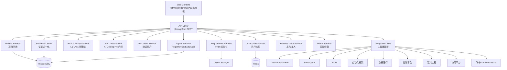
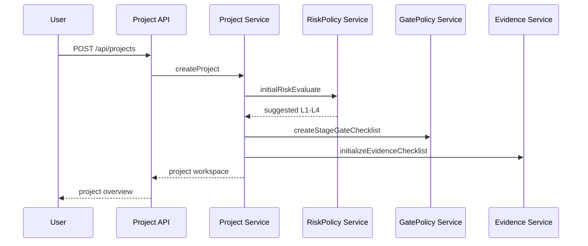
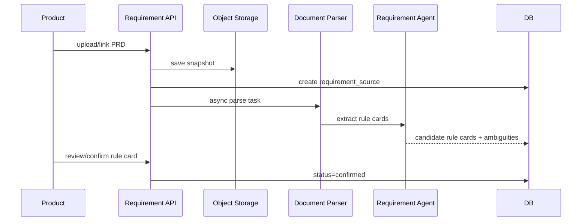
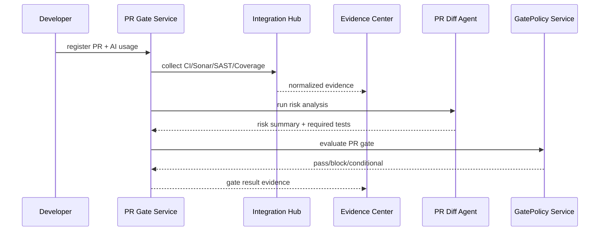
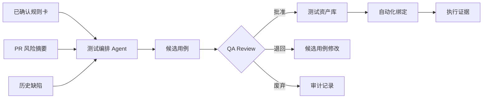
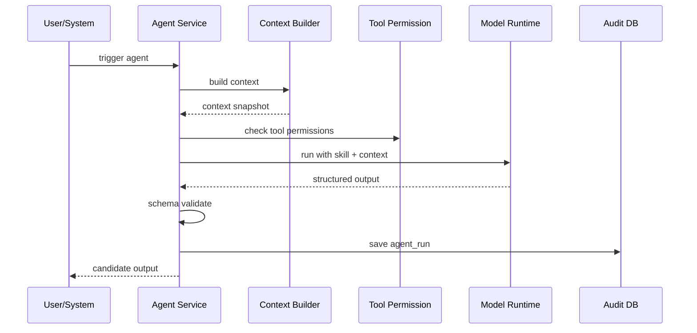
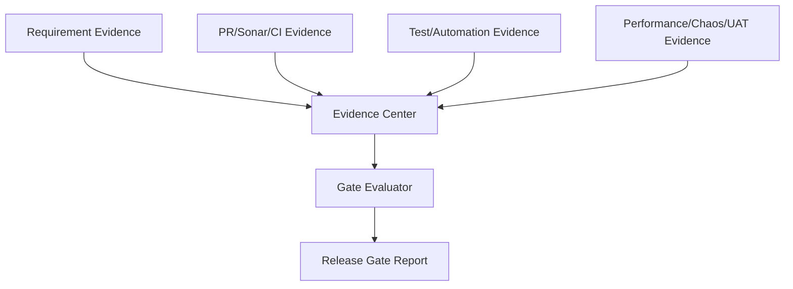

# AI 质量保障平台技术实现方案

版本：v0.1  
日期：2026-06-15  
输入文档：`docs/requirements/` 下 8 份需求文档、`docs/2026-ai-quality-transformation-annual-plan.md`、`docs/product-grade-ai-quality-platform-technical-solution.md`

## 1. 方案目标

本方案用于把需求文档转化为可开发、可集成、可演进的技术实现方案，支撑 1000+ 人研发组织一年数百个项目在 AI Coding 时代完成从 PRD、方案、PR、测试、UAT、发布到复盘的质量闭环。

平台定位不是替代 Git、CI/CD、Sonar、自动化平台、数据银行、性能平台或混沌工程，而是作为研发质量控制面：

- 统一项目空间。
- 统一风险分级。
- 统一阶段门禁。
- 统一证据中心。
- 统一 Agent 运营。
- 统一质量经营看板。

## 2. 核心设计原则

1. 大型企业项目优先：项目必须支持多系统、多仓库、多 PR、多角色、多阶段证据。
2. 风险驱动门禁：L1-L4 决定流程、证据、测试和审批强度。
3. AI 生成内容候选化：Agent 只能生成候选规则、候选用例、候选建议，正式资产必须人工确认。
4. 证据归一化：所有工具结果都进入 Evidence Center，再被门禁、发布准入和看板消费。
5. Agent 工程化：Agent 必须有配置、版本、Skill、Schema、权限、上下文、评测和审计。
6. 模块化单体优先：一期用模块化单体降低落地复杂度，保留后续服务化拆分边界。
7. 审计可追溯：风险降级、门禁豁免、Agent 输出采纳、发布准入必须可追踪。

## 3. 总体架构

### 3.1 技术栈建议

| 层级 | 技术选型 | 说明 |
| --- | --- | --- |
| 前端 | React + TypeScript + React Router | 产品级多页面工作台 |
| 前端请求 | TanStack Query | 服务端状态、缓存、重试 |
| 表单校验 | React Hook Form + Zod | 项目、风险评估、Agent 配置等复杂表单 |
| 表格 | TanStack Table | 项目、PR、用例、证据列表 |
| 图表 | ECharts | 质量经营看板 |
| 后端 | Java 21 + Spring Boot 3 | 企业级后端主框架 |
| ORM | MyBatis Plus | 便于复杂查询、报表、JSONB 字段 |
| 数据库 | PostgreSQL | 主业务库，使用 JSONB 承载动态证据和策略 |
| 缓存 | Redis | 短期锁、任务状态、幂等控制 |
| 对象存储 | MinIO/S3 | PRD、报告、附件、原始工具结果 |
| 异步任务 | Spring Scheduler + Quartz | 工具同步、Agent 运行、报告生成 |
| API 文档 | OpenAPI/Swagger | 前后端契约 |
| 权限 | SSO/OIDC + RBAC | 企业身份体系 |
| 审计 | Audit Log + 操作日志 | 风险、门禁、Agent、发布追溯 |

### 3.2 逻辑架构



### 3.3 后端模块边界

| 模块 | 职责 | 主要需求文档 |
| --- | --- | --- |
| Project | 项目空间、多系统、多仓库、项目阶段、成员和阻断项 | 01 |
| Requirement | PRD 来源、规则卡、歧义点、版本管理 | 02 |
| RiskPolicy | L1-L4 风险评估、门禁清单、阶段准入退出 | 03 |
| PRGate | PR 登记、AI 使用说明、Sonar/CI 证据、PR 门禁 | 04 |
| TestAsset | 候选用例、Review、入库、自动化绑定、缺陷反哺 | 05 |
| AgentOps | 8 个 Agent、Skill、Schema、Context、Tool Permission、Eval、Audit | 06 |
| Evidence | 证据对象、证据完整率、发布准入证据链 | 07 |
| Integration | Sonar、CI、自动化、数据银行、性能、混沌、缺陷、文档工具 Adapter | 02/04/07 |
| ReleaseGate | 发布准入、阻断项、豁免、准入报告 | 03/07 |
| Metric | 公司级、业务域、项目组合、Agent 运营看板 | 08 |

## 4. 核心领域模型

### 4.1 项目空间模型

项目空间采用四层模型：

```text
Project -> ProjectSystem -> Repository -> PullRequest
```

不能使用单个 `repo_url` 代表项目代码范围。

核心表：

```sql
create table project (
  id varchar(64) primary key,
  project_code varchar(64) not null unique,
  name varchar(256) not null,
  business_domain varchar(128) not null,
  project_type varchar(64) not null,
  risk_level varchar(16) not null,
  status varchar(32) not null,
  owner_id varchar(64) not null,
  qa_owner_id varchar(64),
  planned_release_window varchar(128),
  created_by varchar(64) not null,
  created_at timestamp not null,
  updated_at timestamp not null
);

create table project_system (
  id varchar(64) primary key,
  project_id varchar(64) not null,
  system_code varchar(128) not null,
  system_name varchar(256) not null,
  business_domain varchar(128),
  owner_id varchar(64),
  is_core_system boolean not null default false,
  upstream_systems_json jsonb,
  downstream_systems_json jsonb,
  release_constraints_json jsonb,
  created_at timestamp not null,
  updated_at timestamp not null
);

create table project_repository (
  id varchar(64) primary key,
  project_id varchar(64) not null,
  system_id varchar(64) not null,
  repo_name varchar(256) not null,
  repo_url varchar(512) not null,
  default_branch varchar(128),
  language varchar(64),
  ci_pipeline_ref varchar(256),
  sonar_project_key varchar(256),
  automation_suite_mapping_json jsonb,
  owner_id varchar(64),
  enabled boolean not null default true,
  created_at timestamp not null,
  updated_at timestamp not null
);

create table project_member (
  id varchar(64) primary key,
  project_id varchar(64) not null,
  user_id varchar(64) not null,
  role_code varchar(64) not null,
  required_for_risk_levels_json jsonb,
  created_at timestamp not null
);
```

### 4.2 需求和规则卡模型

```sql
create table requirement_source (
  id varchar(64) primary key,
  project_id varchar(64) not null,
  source_type varchar(32) not null,
  source_title varchar(256),
  file_name varchar(256),
  file_uri varchar(512),
  external_url varchar(1024),
  external_provider varchar(64),
  external_doc_id varchar(256),
  source_version varchar(128),
  content_hash varchar(128),
  raw_snapshot_uri varchar(512),
  parse_status varchar(32) not null,
  uploaded_by varchar(64),
  created_at timestamp not null,
  updated_at timestamp not null
);

create table requirement_rule_card (
  id varchar(64) primary key,
  project_id varchar(64) not null,
  source_id varchar(64) not null,
  title varchar(512) not null,
  business_domain varchar(128),
  affected_system_ids_json jsonb,
  user_scenario varchar(128),
  input_conditions text,
  processing_logic text,
  output_result text,
  acceptance_criteria_json jsonb,
  risk_level_suggestion varchar(16),
  source_spans_json jsonb,
  status varchar(32) not null,
  confirmed_by varchar(64),
  confirmed_at timestamp,
  created_at timestamp not null,
  updated_at timestamp not null
);

create table requirement_ambiguity (
  id varchar(64) primary key,
  project_id varchar(64) not null,
  source_id varchar(64),
  rule_card_id varchar(64),
  ambiguity_type varchar(64) not null,
  description text not null,
  owner_id varchar(64),
  status varchar(32) not null,
  resolution text,
  resolved_by varchar(64),
  resolved_at timestamp,
  created_at timestamp not null
);
```

### 4.3 风险与门禁模型

```sql
create table risk_assessment (
  id varchar(64) primary key,
  project_id varchar(64) not null,
  target_type varchar(32) not null,
  target_id varchar(64) not null,
  business_impact varchar(32),
  system_scope varchar(32),
  data_impact varchar(32),
  user_impact varchar(32),
  recoverability varchar(32),
  ai_generated_ratio numeric(5,2),
  historical_risk varchar(32),
  is_core_flow boolean,
  is_cross_repo boolean,
  suggested_level varchar(16) not null,
  final_level varchar(16) not null,
  reason text,
  assessed_by varchar(64),
  created_at timestamp not null
);

create table gate_policy (
  id varchar(64) primary key,
  stage_code varchar(64) not null,
  risk_level varchar(16) not null,
  required_evidence_types_json jsonb,
  required_approvals_json jsonb,
  required_tests_json jsonb,
  blocking_rules_json jsonb,
  enabled boolean not null default true,
  version varchar(32) not null,
  created_at timestamp not null,
  updated_at timestamp not null
);

create table gate_result (
  id varchar(64) primary key,
  project_id varchar(64) not null,
  stage_code varchar(64) not null,
  target_type varchar(32),
  target_id varchar(64),
  risk_level varchar(16) not null,
  decision varchar(32) not null,
  blockers_json jsonb,
  missing_evidence_json jsonb,
  policy_version varchar(32),
  evaluated_at timestamp not null,
  evaluated_by varchar(64)
);
```

### 4.4 PR 门禁模型

```sql
create table pull_request (
  id varchar(64) primary key,
  project_id varchar(64) not null,
  system_id varchar(64) not null,
  repository_id varchar(64) not null,
  provider varchar(32) not null,
  external_id varchar(128) not null,
  title varchar(512),
  author_id varchar(64),
  reviewer_ids_json jsonb,
  source_branch varchar(256),
  target_branch varchar(256),
  url varchar(1024),
  changed_files_json jsonb,
  linked_rule_card_ids_json jsonb,
  risk_level varchar(16),
  status varchar(32),
  created_at timestamp,
  updated_at timestamp
);

create table pr_ai_usage (
  id varchar(64) primary key,
  pr_id varchar(64) not null,
  ai_tool varchar(128),
  ai_usage_scope text,
  ai_generated_ratio numeric(5,2),
  prompt_assumptions text,
  human_modification_summary text,
  self_check_summary text,
  test_added_summary text,
  created_by varchar(64),
  created_at timestamp not null,
  updated_at timestamp not null
);

create table sonar_result (
  id varchar(64) primary key,
  pr_id varchar(64) not null,
  repository_id varchar(64) not null,
  project_key varchar(256),
  quality_gate_status varchar(32),
  bugs int,
  vulnerabilities int,
  code_smells int,
  coverage numeric(6,2),
  duplicated_lines_density numeric(6,2),
  blocker_issues_json jsonb,
  critical_issues_json jsonb,
  raw_report_uri varchar(512),
  collected_at timestamp not null
);

create table pr_gate_analysis (
  id varchar(64) primary key,
  pr_id varchar(64) not null,
  agent_run_id varchar(64),
  risk_summary text,
  impacted_modules_json jsonb,
  required_tests_json jsonb,
  review_focus_json jsonb,
  blockers_json jsonb,
  evidence_refs_json jsonb,
  human_checkpoints_json jsonb,
  created_at timestamp not null
);
```

### 4.5 测试资产模型

```sql
create table test_case (
  id varchar(64) primary key,
  project_id varchar(64) not null,
  title varchar(512) not null,
  objective text,
  case_type varchar(64) not null,
  priority varchar(16) not null,
  risk_level varchar(16),
  requirement_rule_card_id varchar(64),
  pr_id varchar(64),
  affected_system_ids_json jsonb,
  precondition text,
  test_data_json jsonb,
  steps_json jsonb,
  expected_result text,
  assertions_json jsonb,
  negative_or_boundary text,
  automation_recommendation_json jsonb,
  traceability_json jsonb,
  review_status varchar(32) not null,
  library_status varchar(32) not null,
  version varchar(32),
  source_type varchar(32),
  source_agent_run_id varchar(64),
  created_by varchar(64),
  reviewed_by varchar(64),
  created_at timestamp not null,
  updated_at timestamp not null
);

create table test_case_review (
  id varchar(64) primary key,
  case_id varchar(64) not null,
  action varchar(32) not null,
  comment text,
  need_automation boolean,
  is_core_p0_p1 boolean,
  reviewer_id varchar(64) not null,
  created_at timestamp not null
);

create table test_case_automation_binding (
  id varchar(64) primary key,
  case_id varchar(64) not null,
  binding_type varchar(64) not null,
  framework varchar(128),
  suite varchar(256),
  case_key varchar(256),
  data_template_ref varchar(256),
  status varchar(32) not null,
  created_by varchar(64),
  created_at timestamp not null
);
```

### 4.6 执行与证据模型

```sql
create table test_execution (
  id varchar(64) primary key,
  project_id varchar(64) not null,
  execution_type varchar(64) not null,
  external_task_id varchar(128),
  suite varchar(256),
  triggered_by varchar(64),
  total_count int,
  passed_count int,
  failed_count int,
  skipped_count int,
  status varchar(32) not null,
  report_url varchar(1024),
  logs_url varchar(1024),
  started_at timestamp,
  finished_at timestamp
);

create table quality_evidence (
  id varchar(64) primary key,
  project_id varchar(64) not null,
  stage_code varchar(64),
  evidence_type varchar(64) not null,
  source_system varchar(64),
  source_id varchar(128),
  source_url varchar(1024),
  status varchar(32) not null,
  result varchar(32),
  title varchar(256),
  summary text,
  metrics_json jsonb,
  owner_id varchar(64),
  expires_at timestamp,
  related_requirement_ids_json jsonb,
  related_pr_ids_json jsonb,
  related_case_ids_json jsonb,
  risk_level varchar(16),
  collected_at timestamp not null,
  updated_at timestamp not null
);
```

### 4.7 Agent 模型

```sql
create table agent_definition (
  id varchar(64) primary key,
  agent_code varchar(128) not null,
  name varchar(128) not null,
  stage_code varchar(64) not null,
  owner_id varchar(64),
  version varchar(32) not null,
  status varchar(32) not null,
  skill_prompt text not null,
  input_schema_json jsonb,
  output_schema_json jsonb,
  runtime_config_json jsonb,
  created_at timestamp not null,
  updated_at timestamp not null
);

create table agent_tool_permission (
  id varchar(64) primary key,
  agent_id varchar(64) not null,
  tool_type varchar(64) not null,
  permission_level varchar(32) not null,
  approval_required boolean not null default false,
  scope_json jsonb,
  created_at timestamp not null
);

create table agent_context_snapshot (
  id varchar(64) primary key,
  project_id varchar(64) not null,
  agent_id varchar(64) not null,
  user_id varchar(64) not null,
  context_json jsonb not null,
  redactions_json jsonb,
  created_at timestamp not null
);

create table agent_run (
  id varchar(64) primary key,
  project_id varchar(64),
  agent_id varchar(64) not null,
  agent_version varchar(32) not null,
  trigger_type varchar(64),
  input_ref varchar(256),
  context_snapshot_id varchar(64),
  output_json jsonb,
  evidence_refs_json jsonb,
  human_checkpoints_json jsonb,
  status varchar(32) not null,
  confidence numeric(5,2),
  started_at timestamp,
  finished_at timestamp
);

create table agent_feedback (
  id varchar(64) primary key,
  agent_run_id varchar(64) not null,
  feedback_action varchar(32) not null,
  feedback_comment text,
  user_id varchar(64) not null,
  created_at timestamp not null
);

create table agent_eval_case (
  id varchar(64) primary key,
  agent_id varchar(64) not null,
  eval_type varchar(64) not null,
  input_json jsonb not null,
  expected_json jsonb,
  status varchar(32) not null,
  created_at timestamp not null
);

create table agent_eval_result (
  id varchar(64) primary key,
  agent_id varchar(64) not null,
  agent_version varchar(32) not null,
  eval_case_id varchar(64) not null,
  status varchar(32) not null,
  score numeric(5,2),
  actual_json jsonb,
  evaluated_at timestamp not null
);
```

## 5. 核心业务流程实现

### 5.1 项目创建和空间初始化



实现要点：

- 创建项目时支持批量提交系统、仓库和成员。
- 风险初评由规则引擎根据业务域、项目类型、核心链路、多仓库、AI 预估占比计算。
- L3/L4 项目缺少 QA Owner、系统 Owner 时生成阻断项。
- 项目阶段按照模板初始化：需求、方案、编码、PR、测试、UAT、发布、复盘。

### 5.2 PRD 导入和规则卡确认



实现要点：

- 文件类 PRD 保存原始文件和文本快照。
- 飞书、Confluence、Jira 一期先登记链接和元数据，二期通过 Adapter 拉正文。
- 前端 PRD 导入必须使用级联选择：`source_category -> source_provider -> import_action`。
- `source_category` 决定表单区域，例如本地上传展示文件控件，协作文档展示链接和外部文档 ID，研发协同展示 Jira/需求单 URL。
- `source_provider` 映射 Adapter 类型，例如 `feishu`、`confluence`、`jira`、`markdown_file`、`paste_text`。
- `import_action` 决定后端处理方式，例如 `upload_snapshot`、`parse_text`、`register_link`、`sync_by_adapter`。
- 一期未完成正文 API 拉取的来源，使用 `register_link` 方式登记，并在 `requirement_source` 中保留后续 Adapter 同步所需字段。
- 需求澄清 Agent 输出必须包含 `source_spans`，保证规则卡可追溯原文。
- 歧义点未关闭时，L3/L4 不允许需求阶段门禁通过。

级联配置建议由前端常量或后端配置接口返回：

```json
[
  {
    "category": "local",
    "label": "本地上传",
    "providers": [
      {"id": "markdown", "label": "Markdown", "actions": ["upload_snapshot"]},
      {"id": "word", "label": "Word", "actions": ["upload_snapshot"]},
      {"id": "pdf", "label": "PDF", "actions": ["upload_snapshot"]}
    ]
  },
  {
    "category": "collaboration",
    "label": "协作文档",
    "providers": [
      {"id": "feishu", "label": "飞书文档", "actions": ["register_link", "sync_by_adapter"]},
      {"id": "confluence", "label": "Confluence", "actions": ["register_link", "sync_by_adapter"]}
    ]
  }
]
```

### 5.3 风险分级和阶段门禁

风险判级服务分两步：

1. `RiskEvaluationService` 根据判级维度输出建议等级。
2. `GatePolicyService` 根据最终等级生成阶段门禁清单。

判级伪代码：

```java
RiskLevel evaluate(RiskInput input) {
    if (input.involvesFundOrSecurity()
        || input.involvesBatchProductionData()
        || input.involvesMajorPromotionCoreFlow()) {
        return L4;
    }
    if (input.isCoreTransactionFlow() || input.isCrossSystemAndCrossRepo()) {
        return L3;
    }
    RiskLevel base = scoreByImpactAndRecoverability(input);
    if (input.aiGeneratedRatioHigh() && input.evidenceInsufficient()) {
        return base.upgrade();
    }
    return base;
}
```

阶段门禁不直接硬编码在业务逻辑中，而是存储在 `gate_policy` 中，便于后续治理和调整。

### 5.4 AI Coding PR 门禁



实现要点：

- PR 必须关联 Repository，Repository 必须关联 System。
- 多仓库风险通过同项目下未完成 PR 集合识别。
- AI 使用说明缺失时，L2 及以上 PR 门禁不能通过。
- Sonar ERROR、阻断级漏洞、覆盖率低于基线等进入 `blocking_rules_json`。
- PR Diff Agent 输出仅作为建议，最终门禁结论由 Policy Engine 根据证据计算。

### 5.5 测试资产生成、Review 和入库



用例状态机：

```text
candidate -> in_review -> returned -> approved -> baselined
                         -> rejected
```

实现要点：

- `professional-test-case-generation-skill/v1` 作为测试编排 Agent 的 Skill 基线。
- Agent 只能写入 `candidate` 用例。
- QA Review 通过后才能变成 `baselined`。
- P0/P1 核心链路用例未绑定自动化时，系统生成待办或风险提示。
- 执行结果进入 Evidence Center，与用例、PR、规则卡关联。
- 测试资产页面必须面向百千级用例管理，不能把所有用例平铺在一个表格中。
- 前端应提供分组索引、筛选条件、Review 队列、资产库列表和详情阅读区。
- 默认分组维度为状态，支持切换到系统、用例类型、优先级、自动化状态。
- 用例详情采用右侧详情面板或展开行，展示步骤、测试数据、断言、追溯和 Review 记录。
- 批量操作只对当前筛选结果生效，并必须写入审计记录。

测试资产查询建议支持以下参数：

```text
GET /api/projects/{projectId}/test-cases?status=candidate&priority=P0&type=api&system=订单服务&keyword=金额
```

一期可以先在前端完成筛选和分组，后端保留分页、筛选、排序参数口子；当单项目用例超过 1000 条时，将筛选下推到后端。

### 5.6 Agent 运行机制



实现要点：

- Agent 运行前必须生成 `agent_context_snapshot`。
- Context Builder 只注入当前项目授权数据。
- L4 项目上下文必须带审批、审计和风险约束。
- Agent 输出必须通过 JSON Schema 校验。
- Agent 关键工具调用写审计。
- 一期不允许 Agent 直接执行 approve 类动作。

### 5.7 证据中心和发布准入



证据完整率计算：

```text
evidence_completeness =
  completed_required_evidence / total_required_evidence
```

但以下情况直接阻断：

- 阻断类证据失败。
- L3/L4 缺少核心链路测试证据。
- L4 缺少回滚/补偿方案。
- Sonar 阻断结果失败。
- 未关闭 P0/P1 缺陷且无批准豁免。

发布准入结论：

- pass：全部必要证据满足，无阻断项。
- conditional：存在低风险遗留项，有明确 Owner、截止时间和批准记录。
- blocked：存在阻断证据失败或必要证据缺失。

### 5.8 质量经营看板

看板数据不直接扫业务表实时计算，而是通过 `metric_snapshot` 周期化沉淀，保证性能和口径稳定。

```sql
create table metric_snapshot (
  id varchar(64) primary key,
  metric_scope varchar(32) not null,
  scope_id varchar(64),
  metric_date date not null,
  metrics_json jsonb not null,
  generated_at timestamp not null
);
```

指标来源：

- 项目数量和风险分布：Project。
- PR 门禁执行率：PullRequest + GateResult。
- 证据完整率：QualityEvidence + GatePolicy。
- 用例 Review 率：TestCase + TestCaseReview。
- 自动化绑定率：TestCaseAutomationBinding。
- Agent 采纳率：AgentRun + AgentFeedback。

## 6. API 设计

### 6.1 项目空间

```text
POST   /api/projects
GET    /api/projects
GET    /api/projects/{projectId}
PATCH  /api/projects/{projectId}
POST   /api/projects/{projectId}/systems
PATCH  /api/projects/{projectId}/systems/{systemId}
POST   /api/projects/{projectId}/repositories
PATCH  /api/projects/{projectId}/repositories/{repositoryId}
GET    /api/projects/{projectId}/overview
GET    /api/projects/{projectId}/blockers
```

### 6.2 需求导入

```text
POST   /api/projects/{projectId}/requirements/sources/upload
POST   /api/projects/{projectId}/requirements/sources/link
GET    /api/projects/{projectId}/requirements/sources
POST   /api/requirement-sources/{sourceId}/parse
GET    /api/projects/{projectId}/requirement-rule-cards
PATCH  /api/requirement-rule-cards/{cardId}
POST   /api/requirement-rule-cards/{cardId}/confirm
GET    /api/projects/{projectId}/requirement-ambiguities
POST   /api/requirement-ambiguities/{ambiguityId}/resolve
```

### 6.3 风险和门禁

```text
POST   /api/projects/{projectId}/risk-assessments
GET    /api/projects/{projectId}/risk-assessments
POST   /api/projects/{projectId}/gate-checklists/generate
GET    /api/projects/{projectId}/gate-results
POST   /api/gate-results/{gateResultId}/exception
GET    /api/policies/gates
PUT    /api/policies/gates/{policyId}
```

### 6.4 PR 门禁

```text
POST   /api/projects/{projectId}/prs
GET    /api/projects/{projectId}/prs
GET    /api/prs/{prId}
PATCH  /api/prs/{prId}
POST   /api/prs/{prId}/ai-usage
POST   /api/prs/{prId}/collect-evidence
POST   /api/prs/{prId}/analyze
POST   /api/prs/{prId}/gate/evaluate
GET    /api/prs/{prId}/gate-result
```

### 6.5 测试资产

```text
POST   /api/projects/{projectId}/test-cases/generate
GET    /api/projects/{projectId}/test-cases
GET    /api/test-cases/{caseId}
PATCH  /api/test-cases/{caseId}
POST   /api/test-cases/{caseId}/review
POST   /api/test-cases/{caseId}/baseline
POST   /api/test-cases/{caseId}/automation-bindings
GET    /api/projects/{projectId}/test-executions
POST   /api/projects/{projectId}/test-executions
```

### 6.6 Agent 运营

```text
GET    /api/agents
POST   /api/agents
GET    /api/agents/{agentId}
PUT    /api/agents/{agentId}
POST   /api/agents/{agentId}/simulate
POST   /api/agents/{agentId}/eval
POST   /api/agents/{agentId}/publish
POST   /api/agents/{agentId}/rollback
GET    /api/agent-runs
GET    /api/agent-runs/{runId}
POST   /api/agent-runs/{runId}/feedback
```

### 6.7 证据中心和发布准入

```text
POST   /api/projects/{projectId}/evidence
GET    /api/projects/{projectId}/evidence
GET    /api/evidence/{evidenceId}
POST   /api/projects/{projectId}/evidence/refresh
GET    /api/projects/{projectId}/evidence/completeness
POST   /api/projects/{projectId}/release-gate/evaluate
GET    /api/projects/{projectId}/release-gate
GET    /api/projects/{projectId}/release-report
```

### 6.8 质量经营

```text
GET    /api/metrics/company
GET    /api/metrics/business-domains
GET    /api/metrics/project-portfolio
GET    /api/metrics/agents
POST   /api/metrics/snapshots/generate
```

## 7. 集成 Adapter 设计

### 7.1 统一接口

```java
public interface IntegrationAdapter<I, O> {
    String type();
    HealthCheckResult healthCheck(IntegrationConfig config);
    O execute(I request, IntegrationContext context);
    QualityEvidence normalize(O rawResult, EvidenceContext evidenceContext);
}
```

### 7.2 需要对接的外部工具系统

平台需要对接的外部系统分为 9 类。一期允许先做手动登记和链接引用，但技术上必须预留 Adapter、Webhook、同步任务、字段映射和证据归一化口子，避免后续重构。

| 类别 | 外部系统 | 对接目的 | 一期口子 | 二期/三期增强 |
| --- | --- | --- | --- | --- |
| 文档/需求 | 飞书、Confluence、Jira、普通 URL | PRD 导入、需求状态同步、原文追溯 | 登记链接、保存元数据、上传文件快照 | 通过 API 拉取正文、监听版本变化、规则卡差异分析 |
| 代码托管 | GitLab、GitHub、Bitbucket、企业 Git | 仓库、分支、PR、Diff、Reviewer、合并状态 | 手动登记仓库和 PR URL | Webhook 同步 PR，拉取 Diff、文件列表、Review 状态 |
| CI/CD | Jenkins、GitLab CI、GitHub Actions、企业流水线 | 构建状态、单测、覆盖率、制品、部署批次 | 手动登记流水线状态和报告链接 | Webhook 回调、自动采集构建日志和覆盖率 |
| 静态扫描 | SonarQube、SAST、SCA、依赖漏洞平台 | Sonar gate、漏洞、坏味道、覆盖率、依赖风险 | 手动录入关键指标，预留 projectKey | API 拉取分析结果，阻断规则自动计算 |
| 自动化测试 | 接口自动化、E2E、契约测试平台 | 执行 suite、通过率、失败用例、报告 | 登记 suite 和执行结果 | 平台触发执行、回调收集结果、失败归因 |
| 测试数据 | 数据银行、测试账号池、券/库存/订单数据模板 | 构造订单、券、库存、支付异常等测试数据 | 登记数据模板和任务链接 | Agent 生成数据计划，API 创建数据任务，回写数据集引用 |
| 性能平台 | JMeter 平台、压测平台、APM 性能基线 | P95、吞吐、错误率、容量结论 | 登记报告链接和核心指标 | 自动触发压测、拉取趋势、对比基线 |
| 混沌工程 | 故障注入、依赖超时、消息积压、节点故障平台 | 验证降级、恢复、告警和可观测性 | 登记实验记录和结果 | 按风险触发混沌建议或执行，回收实验证据 |
| 缺陷/事故/监控 | 缺陷平台、Oncall、监控告警、事故复盘系统 | 缺陷状态、逃逸缺陷、事故根因、反哺规则 | 登记缺陷和事故链接 | 同步 P0/P1 缺陷、生成用例候选、生成 Agent Eval Case |

### 7.3 外部系统对接口子设计

所有外部工具通过 Integration Hub 接入，不允许业务模块直接调用外部系统。业务模块只依赖标准化后的 Evidence、Execution、RequirementSource、PullRequest 等领域对象。

对接口子分四类：

| 口子 | 作用 | 适用系统 |
| --- | --- | --- |
| Pull API | 平台主动拉取外部数据 | Sonar、Git、缺陷、文档、性能报告 |
| Webhook API | 外部系统主动推送事件 | Git PR、CI、自动化执行、部署流水线 |
| Trigger API | 平台触发外部任务 | 自动化、数据银行、性能、混沌 |
| Link/Register | 一期人工登记链接和结果 | 所有尚未完成 API 对接的系统 |

统一 Webhook 入口：

```text
POST /api/webhooks/{integrationType}/{integrationId}
```

统一同步任务入口：

```text
POST /api/integrations/{integrationId}/sync
GET  /api/integrations/{integrationId}/sync-jobs
GET  /api/integration-sync-jobs/{jobId}
```

统一触发任务入口：

```text
POST /api/integrations/{integrationId}/tool-runs
GET  /api/tool-runs/{toolRunId}
```

### 7.4 外部对象映射

外部系统对象 ID 不能直接作为平台主键。平台需要维护外部对象映射，支持同一个项目跨工具追踪。

```sql
create table external_object_mapping (
  id varchar(64) primary key,
  integration_id varchar(64) not null,
  external_system varchar(64) not null,
  external_object_type varchar(64) not null,
  external_object_id varchar(256) not null,
  internal_object_type varchar(64) not null,
  internal_object_id varchar(64) not null,
  external_url varchar(1024),
  last_synced_at timestamp,
  created_at timestamp not null,
  updated_at timestamp not null
);
```

典型映射：

- Git PR -> PullRequest。
- Sonar analysis -> SonarResult + QualityEvidence。
- CI build -> QualityEvidence。
- 自动化执行任务 -> TestExecution + QualityEvidence。
- 数据银行任务 -> QualityEvidence。
- 缺陷单 -> DefectItem + RetroItem + TestCase candidate。
- 飞书文档 -> RequirementSource。

### 7.5 Webhook 和同步任务模型

```sql
create table webhook_event (
  id varchar(64) primary key,
  integration_id varchar(64) not null,
  event_type varchar(128) not null,
  external_event_id varchar(256),
  payload_json jsonb not null,
  signature_valid boolean,
  process_status varchar(32) not null,
  error_message text,
  received_at timestamp not null,
  processed_at timestamp
);

create table integration_sync_job (
  id varchar(64) primary key,
  integration_id varchar(64) not null,
  sync_type varchar(64) not null,
  target_type varchar(64),
  target_id varchar(64),
  status varchar(32) not null,
  cursor_value varchar(512),
  started_at timestamp,
  finished_at timestamp,
  error_message text,
  created_by varchar(64),
  created_at timestamp not null
);

create table tool_run (
  id varchar(64) primary key,
  integration_id varchar(64) not null,
  tool_type varchar(64) not null,
  project_id varchar(64),
  request_json jsonb not null,
  external_task_id varchar(256),
  status varchar(32) not null,
  result_json jsonb,
  evidence_id varchar(64),
  triggered_by varchar(64),
  started_at timestamp,
  finished_at timestamp,
  created_at timestamp not null
);
```

处理要求：

- Webhook 必须做签名校验、幂等处理和重放保护。
- 同步任务必须支持失败重试、游标续拉和错误可见。
- 触发外部任务必须记录请求参数、执行人、外部任务 ID 和结果证据。
- 外部系统不可用时，平台不得整体不可用，应降级为手动登记证据。

### 7.6 字段归一化规范

不同工具状态和字段不一致，必须归一化到平台标准对象。

| 外部结果 | 平台归一化对象 | 关键字段 |
| --- | --- | --- |
| PR opened/updated/merged | PullRequest | repository_id、external_id、status、changed_files |
| Sonar quality gate | SonarResult + QualityEvidence | quality_gate_status、bugs、vulnerabilities、coverage |
| CI build | QualityEvidence | status、result、source_url、metrics_json |
| Unit test coverage | QualityEvidence | coverage、baseline_coverage、delta |
| Automation run | TestExecution + QualityEvidence | total、passed、failed、pass_rate、failed_cases |
| Data task | QualityEvidence | data_template、data_set_ref、status |
| Performance report | QualityEvidence | p95、throughput、error_rate、baseline_delta |
| Chaos experiment | QualityEvidence | fault_type、blast_radius、recovery_time、alert_triggered |
| Defect/Incident | DefectItem + QualityEvidence | severity、status、root_cause、escaped_stage |
| PRD document | RequirementSource | source_type、content_hash、source_version、raw_snapshot_uri |

### 7.7 集成配置模型

```sql
create table integration_config (
  id varchar(64) primary key,
  integration_type varchar(64) not null,
  name varchar(256) not null,
  endpoint_url varchar(1024),
  auth_type varchar(64),
  config_json jsonb not null,
  secret_ref varchar(256),
  status varchar(32) not null,
  owner_id varchar(64),
  health_status varchar(32),
  last_health_check_at timestamp,
  created_at timestamp not null,
  updated_at timestamp not null
);
```

敏感 Token、Webhook secret、OAuth refresh token 不进入业务库，只保存 `secret_ref`。

### 7.8 一期 Adapter 优先级

| 优先级 | Adapter | 一期实现方式 | 必须预留能力 |
| --- | --- | --- | --- |
| P0 | Sonar Adapter | 支持手动录入 + projectKey 配置 | API 拉取 quality gate、issues、coverage |
| P0 | CI Adapter | 支持状态登记 + report URL | Webhook 回调、构建日志、单测结果 |
| P0 | 自动化 Adapter | 支持执行结果登记 + suite 映射 | Trigger API、结果回调、失败用例归一化 |
| P0 | Git Adapter | 支持仓库和 PR URL 登记 | PR Webhook、Diff 拉取、Reviewer 状态 |
| P1 | 数据银行 Adapter | 支持数据模板和任务链接登记 | 创建数据任务、回写数据集引用 |
| P1 | 性能平台 Adapter | 支持报告登记 | 触发压测、拉取 P95/吞吐/错误率 |
| P1 | 混沌工程 Adapter | 支持实验登记 | 触发实验、回收恢复时间和告警证据 |
| P1 | 缺陷平台 Adapter | 支持缺陷登记和反哺 | 同步缺陷状态、逃逸缺陷生成用例候选 |
| P2 | 飞书/Confluence/Jira Adapter | 一期登记链接，二期读取正文 | 文档正文拉取、版本变更检测 |

## 8. 权限和审计

### 8.1 RBAC 角色

| 角色 | 权限 |
| --- | --- |
| Admin | 系统配置、集成配置、策略发布 |
| Project Owner | 项目创建、成员维护、风险确认 |
| Product Owner | PRD 导入、规则卡确认、歧义关闭 |
| Tech Owner | 系统仓库维护、方案影响面确认 |
| Developer | PR 登记、AI 使用说明、代码证据补充 |
| QA Owner | 测试资产 Review、测试结论、质量风险确认 |
| Release Owner | 发布准入、灰度、回滚、豁免审批 |
| Agent Owner | Agent 配置、Eval、发布和回滚 |
| Quality Operator | 看板、复盘、规则优化 |

### 8.2 审计对象

必须审计：

- 项目风险等级调整。
- L3/L4 风险降级。
- 门禁豁免。
- 规则卡确认。
- 用例入库。
- Agent Skill 变更。
- Agent 工具调用。
- 发布准入结论。

```sql
create table audit_log (
  id varchar(64) primary key,
  actor_id varchar(64) not null,
  action varchar(128) not null,
  object_type varchar(64) not null,
  object_id varchar(64) not null,
  before_json jsonb,
  after_json jsonb,
  reason text,
  created_at timestamp not null
);
```

## 9. 非功能设计

### 9.1 性能

- 项目列表、PR 列表、用例列表支持分页、过滤、排序。
- 看板采用快照表，避免每次实时聚合全量数据。
- Agent 运行和工具采集异步化。
- 证据查询按 `project_id + stage_code + evidence_type` 建索引。

### 9.2 可用性

- 工具 Adapter 失败不应导致平台不可用，应标记证据采集失败。
- Agent 失败不应阻断人工流程，应允许人工补充证据。
- 关键异步任务支持重试和幂等。

### 9.3 数据安全

- 外部工具 Token 使用 Secret 管理。
- Agent 上下文默认脱敏。
- 生产测试数据只记录模板和引用，不直接暴露敏感明细。
- L4 项目上下文和审批记录加强审计。

### 9.4 可观测性

- API 请求日志。
- Adapter 同步日志。
- Agent 运行日志。
- 异步任务状态。
- 门禁评估耗时和失败原因。

## 10. 前端页面实现

一级导航：

- Dashboard。
- Projects。
- Requirements。
- Risk Gates。
- Pull Requests。
- Test Assets。
- Evidence Center。
- Release Gates。
- Agents。
- Integrations。
- Metrics。
- Admin。

核心页面：

| 页面 | 核心能力 |
| --- | --- |
| 项目总览 | 阶段、风险、系统、仓库、PR、证据、阻断项 |
| 项目创建 | 多系统、多仓库、成员、初始风险 |
| 需求导入 | 级联式 PRD 导入、来源登记、规则卡、歧义点 |
| 风险门禁 | 风险评估表、门禁清单、调整记录 |
| PR 门禁 | 多仓库 PR、AI 使用说明、Sonar/CI、风险摘要 |
| 测试资产 | 资产概览、分组筛选、Review 队列、用例详情、入库、自动化绑定、执行结果 |
| Agent 管理 | 8 Agent 配置、Skill、Schema、权限、试运行、审计 |
| 证据中心 | 证据列表、缺失证据、完整率、发布报告 |
| 质量看板 | 公司级、业务域、项目组合、Agent 运营 |

## 11. 分阶段实施计划

### 阶段 1：主链路 MVP，7-8 月

交付：

- 项目空间：Project/System/Repository。
- PRD 导入：级联式来源选择，文件、文本、飞书、Confluence/Jira、URL 登记。
- 需求规则卡：候选、确认、歧义点。
- 风险分级：风险评估表、L1-L4、门禁清单。
- PR 门禁：PR 登记、AI 使用说明、Sonar/CI 手动录入、门禁结论。
- 测试资产：候选生成、分组筛选、详情 Review、入库、自动化绑定。
- 证据中心：统一证据对象、证据完整率、发布准入报告。
- 集成底座：IntegrationConfig、ExternalObjectMapping、WebhookEvent、SyncJob、ToolRun 数据模型和 API 口子。

不做：

- 全量外部工具自动接入。
- Agent 自动执行外部工具。
- 自动阻断 Git 合并。

### 阶段 2：Agent 编排与工具集成，9-10 月

交付：

- Agent Registry。
- Context Builder。
- Agent Run/Audit。
- Git、Sonar、CI、自动化、数据银行 Adapter 初步接入。
- 性能、混沌、缺陷、飞书/Confluence/Jira Adapter 完成字段映射和证据归一化。
- Webhook 签名校验、幂等处理、同步任务重试机制。
- PR Diff Agent 输出必跑测试。
- 测试编排 Agent 输出测试计划和数据计划。
- 发布决策 Agent 输出证据缺口和风险建议。

### 阶段 3：复盘闭环与知识沉淀，11 月

交付：

- 缺陷反哺测试资产。
- 真实缺陷生成 Agent Eval Case。
- 规则库和缺陷知识库。
- 门禁误阻断、漏检复盘机制。

### 阶段 4：规模化推广与经营看板，12 月

交付：

- 公司级质量看板。
- 业务域质量看板。
- Agent 运营看板。
- 月度质量经营报告。
- 多业务域推广模板。

## 12. 需求到技术实现映射

| 需求文档 | 核心技术实现 |
| --- | --- |
| 01 项目空间 | Project/System/Repository/Member/Stage/Blocker 模型，项目总览 API |
| 02 需求导入 | RequirementSourceAdapter、Document Parser、RuleCard、Ambiguity、Source Span |
| 03 风险门禁 | RiskEvaluationService、GatePolicy、GateResult、Risk Audit |
| 04 PR 门禁 | PullRequest、PrAiUsage、SonarResult、PrGateAnalysis、PR Diff Agent |
| 05 测试资产 | TestCase 状态机、Review、Baseline、AutomationBinding、Execution |
| 06 Agent 治理 | AgentDefinition、ToolPermission、ContextSnapshot、AgentRun、Eval、Feedback |
| 07 证据中心 | QualityEvidence、EvidenceCompleteness、ReleaseGate、Adapter Normalize |
| 08 质量看板 | MetricSnapshot、Dashboard API、公司/业务域/项目/Agent 指标 |

## 13. 关键技术风险和应对

| 风险 | 表现 | 应对 |
| --- | --- | --- |
| 工具集成差异大 | 各平台字段和状态不一致 | Adapter + Evidence Normalize，不让业务模块直接依赖工具结构 |
| Agent 输出不可控 | 幻觉、漏证据、误判断 | Schema 校验、证据引用、人工确认、Eval Case |
| 测试资产膨胀 | AI 大量生成重复低价值用例 | Review、去重提示、入库门槛、P0/P1 优先自动化 |
| 风险等级被人为压低 | 高风险项目绕过强门禁 | 自动判级、降级审计、L3/L4 必要审批 |
| 看板口径不一致 | 各团队理解不同 | Metric Snapshot + 指标字典 + 月度口径复盘 |
| 一期范围过大 | 开发周期不可控 | 一期以登记、归一化、人工确认、报告为主，自动化接入二期增强 |

## 14. 一期验收清单

- 一个项目可维护 5 个以上系统、20 个以上仓库。
- PRD 可通过文件、文本、链接登记，并生成可确认规则卡。
- L1-L4 风险评估能生成门禁清单。
- 多仓库 PR 可登记 AI 使用说明、Sonar/CI 结果和门禁结论。
- AI 生成候选用例必须 Review 后才能入库。
- P0/P1 用例能登记自动化绑定。
- L3/L4 项目能生成发布准入报告。
- Agent 配置有 Owner、版本、Schema、工具权限和运行审计。
- 看板能展示项目风险分布、证据完整率、PR 门禁结果、用例 Review 率和 Agent 反馈率。
