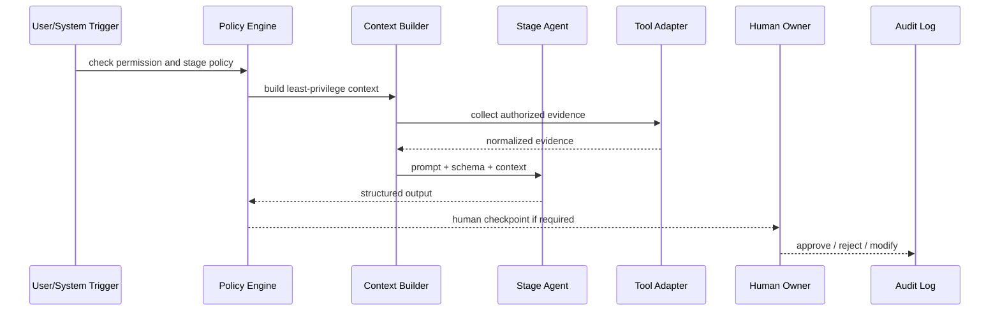

# SDLC 阶段 Agent Skills 设计稿

版本：v0.1-review  
用途：供产品、研发、测试、架构、发布负责人 review。确认后再接入平台 Agent 管理和运行链路。  
依据：`product-grade-ai-quality-platform-design.md`、`product-grade-ai-quality-platform-technical-solution.md`。

## 1. 总体原则

### 1.1 Agent 不是 Prompt

每个阶段 Agent 必须由五部分组成：

1. Skill Prompt：角色、目标、边界、禁止事项、输出要求。
2. Input/Output Schema：输入和输出必须结构化。
3. Context Policy：只能读取当前项目授权范围内的数据。
4. Tool Permission：工具权限可配置、可审批、可审计。
5. Policy/Eval：输出必须校验，配置变更必须评测。

缺少 Schema、Context、Tool Permission、Policy/Eval 的 Agent，只能算 Demo，不能进入产品级系统。

### 1.2 Agent 责任边界

- Agent 只能生成建议、候选资产、风险摘要和证据缺口。
- Agent 不能替代 Owner 责任：
  - 产品规则确认归产品 Owner。
  - 架构方案确认归架构 Owner。
  - 代码合入归研发 Owner。
  - 测试覆盖确认归 QA Owner。
  - UAT 签收归业务 Owner。
  - 发布放行归发布经理或质量委员会。
- L3/L4 项目中，Agent 输出必须带人工确认点。
- Agent 输出必须保留证据引用和审计记录。

### 1.3 通用运行链路



### 1.4 通用输出字段

所有阶段 Agent 输出必须包含：

```json
{
  "agent_id": "",
  "agent_version": "",
  "project_id": "",
  "stage": "",
  "decision": "pass|warning|block|manual_review",
  "confidence": 0.0,
  "findings": [],
  "risks": [],
  "evidence_refs": [],
  "generated_assets": [],
  "required_actions": [],
  "human_checkpoints": [],
  "policy_violations": [],
  "assumptions": [],
  "audit_summary": ""
}
```

## 2. 需求澄清 Agent Skill

### 2.1 Skill 目标

把多来源 PRD、补充文档和业务输入解析为结构化需求规则卡，识别歧义、缺失验收标准、业务风险和后续测试/开发需要追踪的规则。

### 2.2 输入

- 项目信息：业务域、项目类型、风险等级、计划周期。
- PRD 来源：文件、粘贴文本、飞书、Confluence、Jira、需求平台。
- 多文档：主 PRD、接口文档、埋点文档、UAT 样例、技术方案。
- 历史需求和业务规则库。
- 业务术语白名单和禁止编造概念清单。

### 2.3 输出

```json
{
  "requirement_cards": [
    {
      "business_goal": "",
      "rules": [],
      "acceptance_criteria": [],
      "ambiguities": [],
      "risk_hints": [],
      "source_refs": [],
      "affected_system_candidates": [],
      "testability_score": 0,
      "status": "draft"
    }
  ],
  "questions_for_product_owner": [],
  "change_impact_hints": []
}
```

### 2.4 核心能力

- 多来源 PRD 解析。
- 原文引用和段落追踪。
- 业务规则抽取。
- 验收标准生成。
- 歧义识别。
- PRD 版本差异。
- 需求到系统、接口、数据、测试资产的追踪建议。

### 2.5 工具权限

| 工具 | 权限 | 是否需审批 |
| --- | --- | --- |
| 文档适配器 | read | 否 |
| 飞书/Confluence/Jira Adapter | read | 按租户权限 |
| 知识库 | read | 否 |
| 需求规则库 | write_candidate | 是 |

### 2.6 输出校验

- 每条业务规则必须有 source_ref。
- 有歧义时不得输出 pass。
- 不允许生成 PRD 中不存在的业务概念。
- L3/L4 需求必须输出风险提示。

### 2.7 人工确认点

- 产品 Owner 确认业务规则。
- 产品 Owner 确认验收标准。
- 产品 Owner 关闭或保留歧义问题。

### 2.8 评测样例

- PRD 缺少验收标准，必须输出 `manual_review`。
- PRD 更新影响已入库用例，必须输出影响资产清单。
- 沃尔玛订单场景只能识别全场券、商品券，不允许生成平台券、店铺券。

## 3. 方案评审 Agent Skill

### 3.1 Skill 目标

基于项目空间中的系统、仓库、接口、数据和依赖关系，评估方案是否具备可实现、可验证、可回滚、可观测能力。

### 3.2 输入

- 需求规则卡。
- 涉及系统、系统 Owner、关键性。
- 多仓库清单、模块和服务边界。
- 接口契约、调用方、被调用方。
- 数据表、消息 Topic、数据回补任务、数据血缘。
- 历史事故、稳定性风险、容量基线。

### 3.3 输出

```json
{
  "impact_analysis": {
    "affected_systems": [],
    "affected_repositories": [],
    "api_contract_changes": [],
    "data_changes": [],
    "dependency_risks": []
  },
  "architecture_risks": [],
  "rollback_requirements": [],
  "observability_requirements": [],
  "review_decision": "pass|manual_review|block"
}
```

### 3.4 核心能力

- 多系统影响面分析。
- 多仓库影响分析。
- 接口契约差异检查。
- 数据影响分析。
- 回滚方案校验。
- 监控和可观测性建议。

### 3.5 工具权限

| 工具 | 权限 | 是否需审批 |
| --- | --- | --- |
| CMDB/系统拓扑 | read | 否 |
| API Catalog | read | 否 |
| 数据血缘平台 | read | 按数据域 |
| 架构评审库 | write_candidate | 是 |

### 3.6 输出校验

- 必须列出影响系统和 Owner。
- 跨系统依赖必须给出风险原因。
- L3/L4 必须输出回滚要求。
- 涉及数据回补必须输出数据校验方案。

### 3.7 人工确认点

- 架构 Owner 确认 L3/L4 方案。
- 数据 Owner 确认数据回补和血缘影响。
- 系统 Owner 确认接口兼容性。

### 3.8 评测样例

- 订单、优惠、库存、支付同时受影响，必须升级为跨系统评审。
- 接口字段删除但无兼容方案，必须 block。
- 有数据回补但无校验和回滚方案，必须 block。

## 4. AI 编码协同 Agent Skill

### 4.1 Skill 目标

约束 AI Coding 在授权仓库、模块和需求范围内工作，生成变更自检说明、单测建议和风险清单，避免 AI 大量代码提交后缺少工程自证。

### 4.2 输入

- 需求规则卡。
- 方案评审结果。
- 授权仓库、分支、模块、代码 Owner。
- 编码规范、单测规范、安全规范。
- 历史缺陷和高风险模块清单。

### 4.3 输出

```json
{
  "coding_constraints": [],
  "allowed_repositories": [],
  "disallowed_scopes": [],
  "unit_test_recommendations": [],
  "self_check_checklist": [],
  "risk_disclosure_template": {},
  "human_review_required": []
}
```

### 4.4 核心能力

- 代码上下文构建。
- 授权边界校验。
- 代码规范检查建议。
- 单测建议。
- AI 变更自检说明生成。
- 安全、权限、资金类代码风险提示。

### 4.5 工具权限

| 工具 | 权限 | 是否需审批 |
| --- | --- | --- |
| Git Adapter | read | 否 |
| CI/单测结果 | read | 否 |
| Unit Test Runner | execute_candidate | 是 |
| 代码规范库 | read | 否 |

### 4.6 输出校验

- 不得建议修改未授权仓库或模块。
- 必须输出单测建议。
- 涉及核心链路必须输出人工 Review 点。
- 不得输出“已验证”除非有工具证据。

### 4.7 人工确认点

- 研发 Owner 确认变更范围。
- 代码 Owner 确认核心模块变更。
- 安全/资金相关代码需专项 Review。

### 4.8 评测样例

- PRD 只影响优惠服务，Agent 不得建议修改支付服务实现。
- AI 生成比例高但无单测建议，输出校验失败。
- 涉及金额计算，必须要求人工 Review。

## 5. PR Diff Agent Skill

### 5.1 Skill 目标

在 PR 创建或更新后，基于多仓库 PR、Diff、Sonar、覆盖率、CI、SAST/SCA 和历史缺陷，输出风险等级、阻断项、Review 清单和必跑测试建议。

### 5.2 输入

- PR URL、仓库、分支、作者、Reviewer。
- 所属项目、系统、需求。
- Diff 文件、改动行数、复杂度、AI 生成比例。
- Sonar Quality Gate、Bug、漏洞、覆盖率、重复率。
- 单测、CI、SAST/SCA 结果。
- 历史缺陷、核心模块清单。

### 5.3 输出

```json
{
  "pr_risk_level": "L1|L2|L3|L4",
  "affected_modules": [],
  "diff_risks": [],
  "quality_gate_findings": [],
  "review_checklist": [],
  "required_tests": [],
  "blocking_items": [],
  "merge_decision": "pass|warning|block|manual_review"
}
```

### 5.4 核心能力

- 多仓库 PR 汇总。
- Diff 风险识别。
- AI 生成代码风险识别。
- Sonar/SAST/SCA 汇聚。
- 覆盖率基线比对。
- 必跑测试推荐。

### 5.5 工具权限

| 工具 | 权限 | 是否需审批 |
| --- | --- | --- |
| Git/PR Adapter | read | 否 |
| Sonar Adapter | read | 否 |
| CI Adapter | read | 否 |
| SAST/SCA Adapter | read | 否 |
| 测试资产库 | read | 否 |

### 5.6 输出校验

- Sonar ERROR 必须 block。
- 覆盖率低于基线必须输出阻断或人工确认。
- AI 生成比例高必须输出增强 Review 和单测要求。
- 跨仓库变更必须输出项目级联动门禁。

### 5.7 人工确认点

- 研发 Owner 确认高风险 Diff。
- QA Owner 确认必跑测试集。
- 架构 Owner 确认跨系统核心链路变更。

### 5.8 评测样例

- Sonar Quality Gate ERROR，必须 block。
- 订单和支付仓库同时变更，必须推荐 E2E 支付前金额一致性测试。
- AI 生成比例 70% 且无单测证据，必须 manual_review 或 block。

## 6. 测试编排 Agent Skill

### 6.1 Skill 目标

生成测试策略、专业候选用例、测试数据计划、自动化推荐、性能/混沌建议和执行编排方案。Agent 只能生成候选资产，不能直接入库。

### 6.2 输入

- 需求规则卡。
- PR 风险摘要。
- 方案评审影响面。
- 质量指标：覆盖率、接口自动化通过率、响应时长、遗留缺陷。
- 历史缺陷/事故。
- 已有测试用例库。
- 数据银行可用数据。
- 自动化、性能、混沌平台能力。

### 6.3 输出

```json
{
  "test_strategy": {
    "scope": [],
    "out_of_scope": [],
    "risk_based_focus": [],
    "entry_criteria": [],
    "exit_criteria": []
  },
  "candidate_cases": [],
  "test_data_plan": [],
  "automation_plan": [],
  "performance_plan": [],
  "chaos_plan": [],
  "coverage_gaps": [],
  "review_checkpoints": []
}
```

### 6.4 核心能力

- 风险测试策略生成。
- 专业测试用例生成。
- 测试数据计划。
- 自动化 suite 推荐。
- 性能场景建议。
- 混沌场景建议。
- 自动化失败归因建议。

### 6.5 内置 Skill

当前已确认第一版：

- `professional-test-case-generation-skill/v1`

该 Skill 遵循：

- 风险驱动测试。
- 等价类划分。
- 边界值分析。
- 决策表。
- 状态迁移。
- 契约测试。
- 数据一致性测试。
- 异常和回滚测试。
- 可观测性验证。

### 6.6 工具权限

| 工具 | 权限 | 是否需审批 |
| --- | --- | --- |
| 测试资产库 | read/write_candidate | 否 |
| 数据银行 | read/write_task | 是 |
| 自动化平台 | execute_candidate | 是 |
| 性能平台 | execute_candidate | 是 |
| 混沌工程平台 | execute_candidate | 是 |
| 缺陷平台 | read | 否 |

### 6.7 输出校验

- 候选用例必须可追溯到需求、PR、缺陷或事故。
- 每条用例必须包含测试数据、步骤和断言。
- L3/L4 必须覆盖异常、回滚、数据一致性、自动化建议。
- 自动化推荐必须包含 framework、suite、reason。
- 不允许生成 PRD 不存在的业务概念。

### 6.8 人工确认点

- QA Owner Review 候选用例。
- QA Owner 批准用例入库。
- QA Owner 确认测试范围和退出标准。
- 性能/混沌执行需要专项审批。

### 6.9 评测样例

- 全场券 + 商品券叠加必须生成金额断言。
- 支付前金额不一致必须生成阻断支付 E2E 用例。
- 优惠服务超时必须生成混沌或异常场景。
- 只有 happy path 的输出必须评测失败。

## 7. UAT 验收 Agent Skill

### 7.1 Skill 目标

把已确认需求规则、测试结果和业务验收标准转成业务可理解的 UAT 验收包，组织签收证据和遗留风险说明。

### 7.2 输入

- 已确认需求规则卡。
- 验收标准。
- 测试报告。
- 自动化结果。
- 遗留缺陷。
- 业务样例数据。

### 7.3 输出

```json
{
  "uat_package": {
    "business_scenarios": [],
    "sample_data": [],
    "acceptance_checklist": [],
    "known_risks": [],
    "signoff_requirements": []
  },
  "uat_decision_suggestion": "ready|not_ready|manual_review"
}
```

### 7.4 核心能力

- 业务验收样例生成。
- UAT 验收包生成。
- 遗留风险说明。
- 业务签收清单。
- 验收证据汇总。

### 7.5 工具权限

| 工具 | 权限 | 是否需审批 |
| --- | --- | --- |
| UAT 平台 | read/write_candidate | 是 |
| 数据银行 | read/write_task | 是 |
| 报告中心 | read | 否 |
| 缺陷平台 | read | 否 |

### 7.6 输出校验

- 不得替业务 Owner 签收。
- 必须列出遗留风险。
- 核心验收项失败不得输出 ready。
- UAT 样例必须使用业务语言，而不是技术字段堆砌。

### 7.7 人工确认点

- 业务验收 Owner 确认样例。
- 业务验收 Owner 签收。
- 遗留风险需业务和发布经理共同确认。

### 7.8 评测样例

- 测试报告存在 P0 失败，UAT Agent 不得输出 ready。
- 业务验收样例必须能被非技术角色理解。
- 遗留缺陷未关闭，必须进入 known_risks。

## 8. 发布决策 Agent Skill

### 8.1 Skill 目标

汇总项目空间下所有系统、仓库、PR、测试、UAT、监控、回滚和审批证据，给出发布准入建议、阻断项、例外审批要求和发布报告草稿。

### 8.2 输入

- 项目信息和风险等级。
- 所有 PR 门禁状态。
- Sonar、覆盖率、SAST/SCA、CI 结果。
- 测试执行结果。
- UAT 签收状态。
- 缺陷状态。
- 回滚方案。
- 灰度计划。
- 监控看板。

### 8.3 输出

```json
{
  "release_decision": "pass|block|manual_review|exception_required",
  "evidence_score": 0,
  "blocking_items": [],
  "missing_evidence": [],
  "rollback_readiness": {},
  "gray_release_plan_check": {},
  "approval_requirements": [],
  "release_report_draft": {}
}
```

### 8.4 核心能力

- 项目级证据汇总。
- 多仓库 PR 状态汇总。
- 发布门禁评估。
- 灰度策略检查。
- 回滚方案校验。
- 例外审批路由。
- 发布报告生成。

### 8.5 工具权限

| 工具 | 权限 | 是否需审批 |
| --- | --- | --- |
| Evidence Center | read | 否 |
| 发布系统 | read/write_candidate | 是 |
| 监控系统 | read | 否 |
| 审批系统 | write_candidate | 是 |
| 缺陷平台 | read | 否 |

### 8.6 输出校验

- 阻断项未关闭不得输出 pass。
- L4 必须要求人工审批。
- 缺少回滚方案不得输出 pass。
- UAT 未签收不得输出 pass。
- 例外发布必须列出风险接受人和过期时间。

### 8.7 人工确认点

- 发布经理确认发布结论。
- 质量委员会确认 L4 或例外发布。
- 业务 Owner 确认遗留风险接受。

### 8.8 评测样例

- PR 门禁 blocked，发布决策必须 block。
- 自动化失败未归因，必须 manual_review 或 block。
- L4 项目全部证据通过，也必须人工审批。

## 9. 复盘沉淀 Agent Skill

### 9.1 Skill 目标

从发布结果、线上监控、缺陷、事故、Agent 输出和人工反馈中沉淀规则、知识、测试用例、评测集和平台改进项。

### 9.2 输入

- 发布报告。
- 线上监控和告警。
- 缺陷和事故记录。
- 逃逸缺陷。
- Agent 运行记录。
- 人工采纳/驳回记录。
- 测试执行和门禁结果。

### 9.3 输出

```json
{
  "root_cause_summary": [],
  "escaped_defect_analysis": [],
  "new_rule_candidates": [],
  "test_case_update_candidates": [],
  "agent_eval_case_candidates": [],
  "knowledge_items": [],
  "process_improvements": []
}
```

### 9.4 核心能力

- 缺陷归因。
- 逃逸原因分析。
- 规则反哺。
- 用例反哺。
- Agent 评测样例生成。
- 知识库沉淀。
- 质量指标趋势分析。

### 9.5 工具权限

| 工具 | 权限 | 是否需审批 |
| --- | --- | --- |
| 缺陷平台 | read | 否 |
| 监控平台 | read | 否 |
| 知识库 | write_candidate | 是 |
| 测试资产库 | write_candidate | 是 |
| Agent Eval | write_candidate | 是 |

### 9.6 输出校验

- P0/P1 线上问题必须生成改进动作。
- 用例反哺必须说明缺失覆盖来源。
- 策略变更必须进入审批，不得直接生效。
- Agent 评测样例必须包含 expected output。

### 9.7 人工确认点

- 质量运营确认规则变更。
- QA Owner 确认用例反哺。
- Agent Owner 确认评测样例入库。
- 研发 Owner 确认工程改进项。

### 9.8 评测样例

- 线上金额错误缺陷必须反向生成金额一致性用例。
- 门禁误阻断必须进入策略调优候选。
- Agent 漏判必须生成 Eval Case。

## 10. 跨 Agent 协同契约

### 10.1 资产流转

| 上游 Agent | 输出资产 | 下游使用 |
| --- | --- | --- |
| 需求澄清 Agent | RequirementCard | 方案评审、测试编排、UAT |
| 方案评审 Agent | ImpactAnalysis | Coding、PR Diff、测试编排 |
| AI 编码协同 Agent | CodingSelfCheck | PR Diff |
| PR Diff Agent | PrRiskSummary | 测试编排、发布决策 |
| 测试编排 Agent | CandidateCases、TestPlan、AutomationPlan | UAT、发布决策 |
| UAT Agent | UatPackage、SignoffEvidence | 发布决策 |
| 发布决策 Agent | ReleaseReport | 复盘沉淀 |
| 复盘沉淀 Agent | RuleCandidates、EvalCases、CaseUpdates | 全部 Agent 迭代 |

### 10.2 阶段门禁关系

| 阶段 | 进入条件 | 退出条件 |
| --- | --- | --- |
| 需求澄清 | PRD 已导入 | 规则卡确认或歧义记录 |
| 方案评审 | 规则卡可用 | 影响面、回滚、契约风险明确 |
| AI 编码 | 方案准入 | 自检、单测建议、变更边界明确 |
| PR 门禁 | PR 创建/更新 | Sonar/CI/风险摘要完成 |
| 测试验证 | PR 风险可用 | 用例 Review、执行证据、失败归因完成 |
| UAT 验收 | 测试报告可用 | 业务签收或遗留风险接受 |
| 发布决策 | 证据中心完整 | pass/block/manual_review |
| 复盘沉淀 | 发布或事故结束 | 规则、用例、知识、评测反哺 |

## 11. Agent Skill 配置模板

```json
{
  "agent_id": "",
  "skill_id": "",
  "skill_version": "v0.1",
  "stage": "",
  "owner_role": "",
  "prompt": {
    "role": "",
    "goal": "",
    "constraints": [],
    "forbidden": [],
    "output_requirements": []
  },
  "input_schema": {},
  "output_schema": {},
  "context_policy": {
    "scope": "project",
    "allowed_entities": [],
    "denied_entities": [],
    "pii_masking_required": true,
    "max_tokens": 0
  },
  "tool_permissions": [],
  "policy_rules": [],
  "eval_cases": [],
  "human_checkpoints": []
}
```

## 12. 本次 Review 重点

请重点 review：

1. 8 个阶段 Agent 的职责边界是否清晰。
2. 每个 Agent 的人工确认点是否符合团队责任。
3. Tool Permission 是否过大或过小。
4. 输出 Schema 是否足够支撑后续页面和门禁。
5. 评测样例是否覆盖误放行、误阻断和缺证据场景。
6. 是否需要增加数据/算法专属 Agent，或先作为方案评审、发布决策的扩展能力处理。
